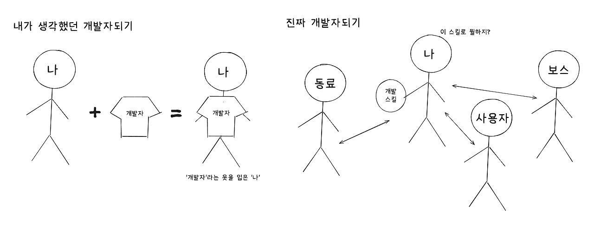

### [The Best Programmers I Know](https://endler.dev/2025/best-programmers/)

오픈소스 관리자이자 Rust 컨설팅 회사 corrode의 설립자 [Matthias Endler](https://endler.dev/about/)는 2025년 4월, 자신이 관찰한 최고의 프로그래머들의 특징을 공유하며 프로그래밍 입문자에게 조언을 주는 **The Best Programmers I Know**를 블로그에 게시했다. 이후 이 글은 레딧과 해커뉴스같은 개발자 커뮤니티에 공유되며 많은 주목을 받았다.

### 2025년 회고하기

나 또한 위 글을 읽고 많이 공감하며 여러 인사이트를 얻을 수 있었다. 사실, 이 글을 처음 읽은 것은 올해 5~6월 쯤이이었는데, 이를 바탕으로 늦은 2024년 회고를 해보면 좋겠다고 생각했다. 하지만, 이런저런 이유로 늦어졌다. 저자는 위 내용이 **체크리스트가 아님**을 명확히 했지만. 이를 체크리스트 삼아 나의 2025년 프로그래밍 경험을 회고해보려 한다.

### 참고 자료(Reference)를 읽으세요

곧바로 아파치 웹서버 문서, 파이썬 표준 라이브러리, 그리그 TOML 명세를 살펴봤다. 리액트 공식문서가 매우 친절함을 다시 한번 확인할 수 있었다.

프론트엔드 개발자로서 내가 사용하는 기술의 공식문서를 꾸준히 읽고 숙지할 필요를 느꼈다. 간단한 내용도 놓치고 있을 때가 종종 있다고 느꼈다.

매일 한 챕터 읽기, API 사용할 때마다 읽기 같이 여러 방법을 시도해봤지만, 아직 부족한 것 같다. 특정 방법을 찾기보다는 무식하게 끼고 사는게 좋을 것 같다.

전문가로 인정받기 위해, 공식문서 어디에 무슨 내용이 있는지 기억할정도로 이를 숙지해야겠다.

### 자신의 도구를 아주 잘 아세요

해당 단락을 읽고, 이런 저런 도구를 써봤다고 나열하기보다 한 도구를 깊게 써 봐야겠다고 생각했다. 특히, 여러 설정 옵션들을 읽고 그 의미를 설정할 수 있을 정도로 한 도구를 잘 알 필요를 느꼈다.

이를 의식해서, 새로운 도구를 사용하기보다는 기존에 사용하던 도구를 의도적으로 더 많이 사용해봤다. 따로, 해당 도구를 학습하려고 하지 않아도, 쓰면서 하나씩 보이게되는것 같다.

한 도구의 전체 기능이 어느 정도이고 내가 그 중 얼마나 숙지하고 있는지 확인해볼 필요를 느꼈다. 고지식하게 한 도구를 고수하는 것처럼 보일정도로 한 도구를 매우 잘 알고 싶다. 물론, 이를 바탕으로 문제해결에 적절한 도구를 선택하는 유연한 사고를 기르고 싶다.

### 에러 메시지를 읽으세요

매번 에러 메시지를 그대로 LLM에 복사/붙혀넣기하던 나를 반성하게 되었다.

의식적으로, 에러 메세지를 읽으려 했다. 그 결과 대부분의 에러 메세지는 매우 친절하며, 때로는 이를 해결할 수 있는 단서를 제공함을 알 수 있었다. 에러 메시지를 그대로 검색하는 것이 LLM보다 더 유용한 결과를 주기도 했다.

물론 에러 메시지를 LLM에게 맡기는게 시간효율적일 수도 있지만, 에러 메시지를 직접 읽었을 때에 장점도 체감할 수 있었다. 내가 어떤 문제를 해결하느라 시간을 소모했는지, 이를 어떻게 해결했는지를 더 명확하게 기억하고 설명할 수 있게 되었다.

앞으로도, 에러 메세지를 읽는 습관을 유지하고 싶다.

### 문제를 분해하세요

기본이지만 항상 어려운 것 같다. 사이드프로젝트를 진행하면서, 한번에 많은 걸 해결하려다 보니 길을 잃을 때가 종종 있었다.

올해는 익숙하지 않던 CS관련 문제를 해결하다보니, 직관적인 접근을 시도할 때 더 많은 한계를 느꼈다. 이 때, 다이어그램을 그려보는 것이 그나마 도움이 되었다.

앞으로는 그림을 더 많이 그려보며, 문제를 분해하고 구조화하고 싶다.

### 손 더럽히는 것을 두려워하지 마세요

관련된 프로그래밍 경험이 없는 것 같다.

어떤 코드든(익숙하지 않은 언어든, 분야든) 피하지 말고 많이 읽고 다뤄보자.

### 항상 다른 사람을 도우세요

올해 여러 사람들과 동료학습을 진행하면서, 나의 영향력에 대해서 고민해 볼 수 있었다.

여태껏, ‘나는 다른 프로그래머를을 돕는 프로그래머인가? 도우려고 한적은 있는가?’ 이런 고민 없이 그냥 달려온 것 같다.  
개발자가 된다는 것을, 그냥 '나'라는 사람이 '개발자'라는 옷을 입는 것으로 착각했다. 다른 사람에게 내가 어떤 개발자이고 싶은지를 더 고민해봐야 할 것 같다.

나의 영향력이 항상 같지는 않다는 것도 느낄 수 있었다. ‘나는 그냥 항상 나’라고 생각했지만, 주변 환경에 따라, 내 영향력이 바뀐다는 것도 확인할 수 있었다. 때로는, 다른 사람을 돕기도 했지만, 때로는 그러지 못했다.

이 과정에서, 내가 '개발자되기'라는 그림을 잘못 그리고 있었다는 것을 알 수 있었다.

내가 어떤 영향력을 미치고 싶은가를 기억하면서 이를 이루기 위해 노력해야하는 것 같다. 내가 어떤 도움을 받았는지를 기억하고 이를 되돌려주려 노력하자. 내가 어떤 강점을 지니고 어떤 약점을 지녔는지 기억하자.

### 글을 쓰세요

올해 초부터 블로그에 글을 쓰고 있다. 올해는 나름 만족스러운 글쓰기 활동을 경험한 것 같다.

대 AI시대에 대응하기 위해, ‘나’만 쓸 수 있는 글을 쓰려고 노력했다. 내가 개발하면서 얻은 관점을 공유하거나 실제 프로젝트에 얻은 데이터와 노하우를 공유하려 노력했다. 꼭 기술관련 글일 필요도 없는 것 같아서, 다른 주제를 시도해 보기도 했다.

하지만, 항상 만족스러웠던 것은 아니다. 한번은, 숙제처럼 의무감에 글을 쓰고, ‘이런 주제로 포스팅하면 좋을것 같은데’라며 내가 잘 알지도 못하는 내용을 급급히 쓰는 것 같아 작성한 내용을 모두 지워버리기도 했다. 물론, 그 과정에서 학습하는 것이 있기 때문에 나쁘지만은 않겠지만, '나'만 쓸 수 있는 글을 쓰겠다는 처음의 취지에서 벗어난 것 같았다.

앞으로도 꾸준히 글쓰기 활동을 이어가면 좋겠다.

### 결코 배우는 것을 멈추지 마세요

올해는 새로운 것들을 많이 학습할 수 있는 기회가 있어서, 잠시 내 입맛은 접어두고, 내게 주어지는 것들에 몰입하며 학습하려고 했다. 결과적으로, Nest.js, MySQL, 클라우드, 인프라, CS 등 평소 친하지 않던 분야에서 만족스럽게 학습한 것 같다.

이 과정에서 구체적인 학습 목표를 설정할 필요를 느꼈다. ‘DB 마스터하기’처럼 추상적인 목표보다 ‘EXPLAIN 명령어로 쿼리 실행계획 확인하고 쿼리속도 개선하기’같이 구체적이고 작은 단위의 목표를 정하고 실행하는 것이 도움이 되었다.

다만, 학습에 조급할 필요는 없는 것 같다. 약간 경우가 다르기도 하지만, 공부할 시간도 없이 무리하기 자격증 시험을 신청하고 포기한적도 있었다.(내 돈!) 불안감에 계획없이 행동한 것 같아 아쉽다. 내년에는 데이터분석과 클라우드 관련 분야의 자격증을 잘 계획해서 도전했으면 한다.

프론트엔드 분야에서는 무지함의 봉우리의 꼭대기에 올라왔다 떨어지는 것을 반복 경험한 것 같다. ‘이제는 좀 경지에 오른것 같은데?’라는 자신감에 어깨가 가벼워졌다가도, 금세 부족한 부분을 확인하고 무너지기도 했다. 이게 내가 성장하고 있다는 증거기도 하겠지만, 너무 자기자신을 과대평가하거나 평가절하할 필요는 없는 것 같다.

### 지위는 중요하지 않습니다

관련된 프로그래밍 경험이 없는 것 같다.

### 평판을 쌓으세요

올해는 오픈소스에 기여해보고 싶은 목표가 있었고, 번역 기여와 타입 기여부터 시작할 수 있었다. 운이 좋게 내가 사용하던 프로젝트의 간단한 이슈를 해결하는 기여도 해볼 수 있었다.

앞으로는 더 많은 사람들이 사용하는 저명한 프로젝트에 기여해보며 평판을 쌓고 싶다. 이를 위해서는, 한 프로젝트를 자주 사용해보며, 잘 알고 좋아애야하는 것 같다. 한 프로젝트를 정해서, 꾸준히 들여다 볼 필요가 있는 것 같다.

### 인내심을 가지세요

올해 인내심을 가지고 꾸준히 공부한 부분도 있지만, 코테 준비에서 인내심이 부족했던 것 같다. 막히는 부분이 있을 때마다 멀리하게 된 것 같다. 인내심을 가지고 코테를 준비해보자.

### 절대 컴퓨터를 탓하지 마세요

관련된 프로그래밍 경험이 없는 것 같다.

### "모르겠습니다"라고 말하는 것을 두려워하지 마세요

흔치 않게 찾아온 면접을 준비하면서, 단 한가지 명심했던 것은 ‘모르는건 모른다’고 말하자였다. 그런데 정말 기묘하게도 매번 내가 단 한번도 생각해보지 않은 것만 물어보는 것 같아 무척 당황했다. 결국 말미에는 찍어서라도 맞추려고 해서 망쳐버린 것 같다.

기본기가 부족했기도 했지만, 그 동안 내가 아는것과 모르는 것의 경계를 확실히 하지 않았다는 것도 느낄 수 있었다. 앞으로, 면접이건 아니건 내가 어디까지 알고 있는지, 무엇을 더 알고싶은지를 말하는 것을 두려워하지 않아야겠다.

### 추측하지 마세요

단순히 내가 직접 간단하게 실험해서 확인 할 수 있는 일도, LLM에게 물어보게 되는 것 같다. 이때 생성된 답변을 신뢰해도 되는지 안해도 되는지 판단하기 어려울 때면, 많은 추측을 하게 되는 것 같다.

추측을 줄이고 관측을 많이 하도록 해보자.

### 단순하게 유지하세요

올해는 사이드프로젝트를 유지보수하는 경험도 해봤고, 다른 사람이 작성한 코드를 리팩토링하는 경험도 해봤다. 그 과정에서, 단순한 코드가 이해하기도 쉽고 유지보수하기도 쉬움을 체험할 수 있었다.

단순하게 유지하기 위해서는 핵심만 남길 수 있어야 하는데 이는 내가 작성한 코드을 완전한 이해하기를 필요로하는 것 같다. 또한 검증되고 유명한 라이브러리를 사용하여 내 코드를 단순화하는 것도, 어떤 라이브러리들이 있는지, 해당 라이브러리가 어떻게 돌아가는건지를 이해해야 잘 할 수 있는 것 같다.

단순하게 유지한다는 목표를 담아두고 실천해보고 싶다.
