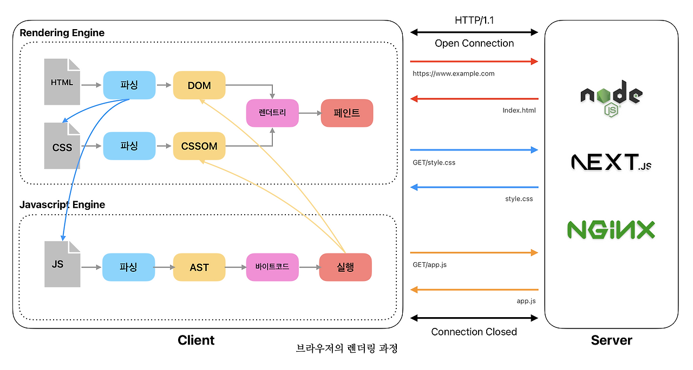

## HTML 파싱과 DOM 생성

브라우저의 요청에 의해 서버가 응답한 [HTML](https://developer.mozilla.org/ko/docs/Web/HTML) 문서는 기본적으로 텍스트이다. 브라우저의 렌더링 엔진은 HTML 텍스트를 파싱하여 [DOM](https://developer.mozilla.org/ko/docs/Web/API/Document_Object_Model/Introduction)(Document Object Model)을 생성한다. DOM이란 브라우저가 문서를 이해할 수 있도록 트리구조로 이루어져 있다.

## CSS 파싱

렌더링 엔진은 HTML을 한 줄씩 순서대로 파싱하며 DOM을 생성한다. 이때 CSS를 로드하는 `<link>` 나 `<style>` 태그가 나오면 DOM 생성을 일시 중지하고 [CSSOM](https://developer.mozilla.org/ko/docs/Web/API/CSS_Object_Model)을 생성한다.

CSSOM에는 CSS의 상속(inheritance) 규칙이 적용된다. 예를 들어, 부모 요소에 적용된 `color` 속성은 자식 요소에도 동일하게 적용된다.

## 렌더트리 생성

DOM과 CSSOM이 모두 만들어지면, 렌더링 엔진은 이 두 가지를 결합하여 렌더 트리를 생성한다. 렌더 트리는 렌더링을 위한 트리이므로, 실제로 화면에 그려질 요소들만 구성된다.

따라서 화면에 표시되지 않는 요소들은 렌더 트리에 포함되지 않는다.

- `display: none` 속성이 적용된 요소
- `<meta>`, `<script>` 등 화면에 보이지 않는 태그

## 자바스크립트 파싱과 실행

기본적으로, 렌더링 엔진이 HTML을 한 줄씩 순서대로 파싱할때 `<script>` 태그를 만나면 렌더링 엔진은 다시 DOM 생성을 중단한다. 그리고 자바스크립트 엔진에게 제어권을 넘겨 자바스크립트 코드를 파싱하고 실행하도록 한다.

이렇게 코드의 순서대로 실행되는 동기적 방식은, 자바스크립트의 실행 동안 DOM 생성이 지연되는 렌더링 블락 현상을 발생시킨다.

따라서, 렌더링 블락 현상을 방지하고 DOM이 완성되지 않은 상태에서 자바스크립트가 DOM을 조작하는 것을 방지하기 위해서, 전통적으로 `<script>` 태그를 `<body>` 태그 최하단에 위치시키는 방법이 널리 사용되었다.

HTML5 부터 렌더링 차단문제를 해결하기 위해서 `<script>` 태그에 `async`와 `defer` 속성이 추가되었다.

- [`async`](https://developer.mozilla.org/ko/docs/Web/HTML/Reference/Elements/script#async) : `async` 속성이 지정된 스크립트는 HTML 파싱과 동시에 비동기적(병렬적으로)으로 다운로드된다. 다운로드가 완료되는 즉시, HTML 파싱이 중단되고 다운로드된 자바스크립트가 실행된다. 자바스크립트 실행이 끝나면 중단되었던 HTML 파싱이 다시 시작된다. 여러 `async` 스크립트가 있을 경우, 다운로드가 먼저 완료되는 순서대로 실행되므로 실행 순서가 보장되지 않는다. 따라서 스크립트 간의 의존성이 없을 때만 사용해야한다.
- [`defer`](https://developer.mozilla.org/ko/docs/Web/HTML/Reference/Elements/script#defer) : `defer` 속성 역시 `async`와 마찬가지로 HTML 파싱과 동시에 **비동기적으로 스크립트를 다운로드**한다. `defer` 스크립트는 다운로드가 완료되더라도 즉시 실행되지 않고, HTML 문서 파싱이 모두 끝나 DOM 생성이 완료된 지후,`DOMContentLoaded` 이벤트가 발생하기 전에 실행된다.
- [`type="module"`](https://developer.mozilla.org/ko/docs/Web/HTML/Reference/Elements/script#type) : `type="module"` 속성은 해당 스크립트가 ES6(ECMAScript 2015)에서 도입된 ESM 모듈 방식을 사용하는 스크립트임을 말한다. `type="module"`로 지정된 스크립트는 별도의 `async`나 `defer` 속성을 명시하지 않아도 기본적으로 `defer`처럼 동작한다. 이는 ESM 모듈 방식의 스크립트는 실행 전 전체 의존성 트리를 파악하고 트리셰이킹을 진행하기 때문이다. 만약 ESM 모듈 방식의 스크립트를 동기적으로 처리한다면, 연쇄적인 모듈 로딩으로 인해 렌더링 차단이 훨씬 심각해질 수 있다. 따라서 브라우저는 모듈 시스템의 안정적인 동작을 위해 기본적으로 `defer` 방식을 채택한다.

## 레이아웃과 페인트

렌더 트리가 생성되면, 브라우저는 각 요소가 화면의 어느 위치에 어떤 크기로 배치되어야 하는지를 계산하는 **레이아웃** 단계를 진행한다.

레이아웃 계산이 완료되면, 브라우저는 이 정보를 바탕으로 색상 등을 반영하여 각 요소를 실제 화면에 그리는 **페인트** 단계를 수행한다.

## 컴포지팅

브라우저는 화면에 그려질 요소들을 각각의 레이어(layer)로 분리하고, 이 레이어들을 결합하여 최종 화면을 구성한다. 이 과정에서는 GPU를 활용하여 각 레이어를 빠르게 합성한다. 이를 하드웨어 가속이라고 한다.

개발자 도구 > 도구 더보기 > 레이어 탭에서 페이지의 레이어를 확인 할 수 있다.

## 리플로우와 리페인트

사용자와의 상호작용이나 동적인 변화에 의해 화면이 다시 그려져야 할 때가 있다.

- 자바스크립트의 DOM API에 의한 노드 추가 또는 삭제
- 브라우저 창의 리사이징에 의한 뷰포트 크기 변경
- 스타일 변경

이때 리플로우와 리페인트가 발생한다.

- **리플로우(Reflow)**: 레이아웃 계산을 다시 하는 과정. 요소의 크기나 위치 변경, 폰트 변경, 브라우저 창 크기 조절 등 레이아웃에 영향을 주는 변경이 발생할 때 실행된다. 리플로우는 연관된 모든 자식 노드와 일부 부모 노드의 레이아웃까지 다시 계산해야 하므로 비용이 크다.
- **리페인트(Repaint)**: 리플로우 결과로 만들어진 렌더 트리를 기반으로 화면을 다시 그리는 과정. 배경색이나 글자색 변경처럼 **레이아웃에 영향을 주지 않는 스타일 변경**이 일어났을 때 발생한다. 리플로우가 발생하면 반드시 리페인트가 뒤따르지만, 리페인트가 항상 리플로우를 유발하지는 않는다.

### 개발자도구로 리플로우와 리페인트 확인하기

1.  라이트하우스

누적 레이아웃 변경(CLS)을 포함한 여러 지표들 측정해준다. 페이지 로드시 레이아웃이 자주 변경되면, 사용자 경험이 저하될 수 있으므로 CLS를 0.1 이하로 유지할 것이 권장된다.

2.  성능 탭

녹화를 통해 특정 기간의 리플로우와 리페인트 발생여부와 원인을 파악할 수 있다.

- 개발자도구 > 성능 탭
- 녹화 버튼을 누르고 리플로우가 발생할 것으로 예상되는 동작(예: 버튼 클릭, 창 크기 조절)을 수행한 뒤, **'**Stop**'** 버튼을 누른다.
- 생성된 프로파일의 타임라인에서 렌더링 부분을 확인한다.
  - 보라색(Layout) 블록: 리플로우가 발생한 구간.
  - 초록색(Paint) 블록: 리페인트가 발생한 구간.

3.  렌더링 탭

도구 더보기 > 렌더링을 클릭하여 렌더링 탭을 열수 있다. 다음과 같은 옵션들을 선택할 수 있다

페인트 플래시 : 리페인트 영역을 녹색으로 표시

레이아웃 변경 지역 : 리플로우 영역을 파란색으로 표시

레이어 테두리 : 레이터 테두리를 표시

프레임 렌더링 통계 : 프레임 처리량, 누락된 프레임 배포, GPU 메모리를 표시

스크롤 성능 문제 : 스크롤과 관련된 이벤트 리스너가 있고 페이지의 성능에 영향을 줄 수 있는 페이지의 요소를 표시

### 리플로우와 리페인트 줄이기

리플로우와 리페인트는 피할 수 없지만, 불필요한 발생을 줄여 성능을 최적화해야 한다. 리플로우가 발생하면 반드시 리페인트가 뒤따르지만, 리페인트가 항상 리플로우를 유발하지는 않으므로, 리플로우를 줄이는 것이 핵심이다.

#### 하드웨어 가속 사용하기

요소가 움직이는 애니메이션을 구성할 땐, `top`, `left`, `width`, `height` 같은 위치 속성을 변경하는 대신 `transform` 속성을 사용하여 리플로우와 리페인트를 줄일 수 있다.

`top`, `left`, `width`, `height` 같은 위치 속성이 변경되면 리플로우와 리페인트가 발생한다. 하지만 `transform`과 `opacity` 속성은 리플로우와 리페인트 과정을 거치지 않고 컴포지팅 단계에서만 처리되므로 성능을 최적화 할 수 있다.

## 참고자료

참고자료 1 : [모던 자바스크립트 Deep Dive](https://wikibook.co.kr/mjs/)

참고자료 2 : [리플로우와 리페인트와 브라우저 렌더링 알아보기](https://mong-blog.tistory.com/entry/%EB%A6%AC%ED%94%8C%EB%A1%9C%EC%9A%B0-%EB%A6%AC%ED%8E%98%EC%9D%B8%ED%8A%B8%EC%99%80-%EB%B8%8C%EB%9D%BC%EC%9A%B0%EC%A0%80-%EB%A0%8C%EB%8D%94%EB%A7%81-%EC%95%8C%EC%95%84%EB%B3%B4%EA%B8%B0)

참고자료 3 : [chrome for developers docs :렌더링 성능 문제 발견](https://developer.chrome.com/docs/devtools/rendering/performance?hl=ko)

참고자료 4 : [mdn : 웹페이지를 표시한다는 것 : 브라우저는 어떻게 동작하는가](https://developer.mozilla.org/ko/docs/Web/Performance/Guides/How_browsers_work)

참고자료 5 : [제주코딩베이스캠프 : 브라우저는 어떻게 화면을 렌더링할까?](https://www.youtube.com/watch?v=z1Jj7Xg-TkU&t=284s)
