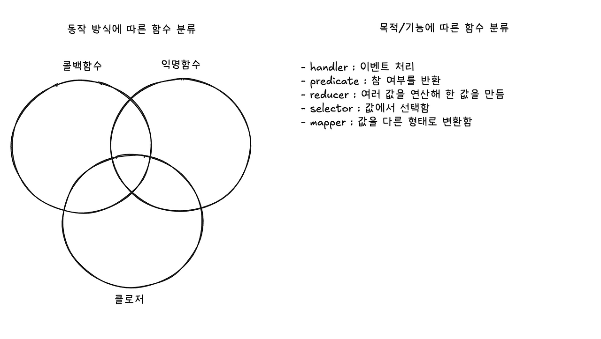

## 콜백 함수(Callback Function)

콜백 함수란 인수(argument)로 다른 함수에 전달되는 함수를 말한다. 일종의 루틴이나 동작을 완료하기 위해 외부 함수 내부에서 호출된다.

### 콜백함수의 용도

- 비동기 처리 : 어떤 작업이 완료되었었을 때 후속 처리를 하기 위해 사용된다.

```js
const fs = require('node:fs');
fs.readFile('/Users/joe/test.txt', 'utf8', (err, data) => {
  if (err) {
    console.error(err);
    return;
  }
  console.log(data);
});
```

- 이벤트 핸들러 : 이벤트가 발생했을 때 실행할 함수를 등록할 때 사용된다.

```html
<button id="myButton">클릭하세요</button>
```

```js
const myButton = document.getElementById("myButton");

// 클릭 이벤트가 발생하면 실행될 콜백함수를 등록한다.
myButton.addEventListener("click", () => {
  alert("버튼이 클릭되었습니다!");
});
```

- 중복 코드 제거 : 연산 등에 코드의 재사용성을 높일 수 있다.

### 함수들의 용도(기능)에 따른 분류

함수들의 용도(기능)에 아래와 같이 분류할 수 도 있다. 다만 이러한 분류는 기능에 따른 분류고, 콜백함수는 사용방법에 따른 분류이기 때문에 아래 함수들이 꼭 콜백 함수일 필요는 없다.

- handler : 이벤트 발생 시 이를 처리할 함수. `addEventListener`의 콜백이 여기에 해당한다.
- predicate : 인수를 받아서 `bolean` 값을 반환하는 함수.

```js
const isOdd = (n) => n % 2 === 1;

// 콜백으로 사용될 때
const odds = [0, 1, 2, 3, 4, 5].filter((v) => isOdd(v)); // [1, 3, 5]

// 콜백이 아닐 때
let num = 3;
if (isOdd(num)) {
  console.log('홀수입니다.');
}
```

- reducer : 여러 값을 하나로 합치는(축약하는) 함수. 최댓값 구하기, 합 구하기, 갯수 세기 등 여러 값들을 이용하여 결과적으로 하나의 값을 만들때 사용한다.

```js
const numbers = [1, 2, 3, 4, 5];

const sum = (acc, cur) => acc + cur;

const count = (acc, cur) => {
  acc[cur] = (acc[cur] || 0) + 1;
  return acc;
};

const max = (acc, cur) => Math.max(acc, cur);

const sumOfNumbers = numbers.reduce(sum, 0);
const countOfNumbers = numbers.reduce(count, {});
const maxOfNumbers = numbers.reduce(max, -Infinity);
```

- selector : 데이터 덩어리(객체, 상태 등)에서 특정 값을 선택(추출)하는 함수

```js
const students = [
  { name: '이순신', score: 87 },
  { name: '홍길동', score: 95 },
  { name: '유관순', score: 91 },
];

const selector = (student) => student.score;

const result = students.map(selector);
```

- mapper : 하나의 값을 다른 값으로 매핑(변환)하는 함수.

```js
const scores = [
  { id: '1', score: 87 },
  { id: '2', score: 95 },
  { id: '3', score: 91 },
];

const names = {
  1: '이순신',
  2: '홍길동',
  3: '유관순',
};

const mapper = (score) => {
  return `${score.id}번 ${names[score.id]}는 ${score.score}점 입니다.`;
};

const result = scores.map(mapper);
```

## 익명 함수(Anonymous Function)

익명 함수란 **이름이 없는 함수**를 말한다. 일회성으로 사용되거나, 함수를 변수에 할당하거나, 다른 함수의 인자로 전달될 때 주로 사용된다.

### 람다 (Lambda, λ)

익명함수는 람다(Lambda)라고도 주로 불린다. 이 이름은 수학자 알론조 처치가 개발한 람다 대수(Lambda Calculus)에서 유래했다. 람다 대수는 함수를 정의하고 적용하는 과정을 매우 단순한 표기법으로 표현하는 형식 체계로, 모든 함수를 이름 없는 익명 함수로 표현하는 것이 특징이다. 이것이 현대 프로그래밍 언어의 익명함수 개념에 큰 영향을 주었다.

자바스크립트에서는 두가지 방법으로 익명함수를 만들 수 있다.

```js
// 함수 표현식으로 만든 익명 함수
(function () {});

// 화살표 표기법으로 만든 익명 함수
() => {};

// 익명함수를 만들어 greet이라는 변수에 저장한다
// 1. 함수 표현식
const greet = function (name) {
  return `Hello, ${name}!`;
};
// 2. 화살표 함수
const greet = (name) => `Hello, ${name}!`;
```

파이썬에서는 `lambda` 키워드를 사용해서 익명함수를 만들 수 있다.

```python
# 익명함수를 만들어 add라는 변수에 저장한다
add = lambda x, y: x + y

# 정렬에서 lambda 사용 예시
students = [
    {'name': '이순신', 'score': 87},
    {'name': '홍길동', 'score': 95},
    {'name': '유관순', 'score': 91}
]

students.sort(key=lambda s: s['score'], reverse=True)
```

#### 익명함수의 장점

- **코드 간결성**: 이름이 없으므로 코드가 짧아지고 가독성이 향상될 수 있다.
- **일회성 사용**: 단 한 번만 사용될 함수를 굳이 이름 붙여 선언할 필요가 없어 편리하다.

#### 익명함수의 단점

- **재사용 불가**: 이름이 없기 때문에 여러 곳에서 재사용하기 어렵다. (익명함수를 변수에 할당하는 것으로 해결가능하다)
- **디버깅의 어려움**: 에러 발생 시 콜 스택(Call Stack)에 함수 이름이 나타나지 않아 `(anonymous function)`으로 표시되므로 디버깅이 까다로울 수 있다.

[**AWS Lambda**](https://aws.amazon.com/ko/lambda/)

번외로 AWS는 Lambda라는 서비스를 운영중이다. 원하는 함수를 서버를 관리할 필요 없이 실행해주는 클라우딩 컴퓨터 서비스이다.

## 클로저 (Closures)

**클로저란 생성될 때의 환경을 기억하고 있는 함수를 말한다.** 즉, 어떤 함수가 자신의 외부 스코프에 있는 변수에 접근할 수 있는 권한을 가질 때, **그 함수와 그 함수가 선언된 렉시컬 환경의 조합을 클로저라고 한다.** 이러한 함수를 클로저 함수라고도 부른다. 함수형 프로그래밍의 핵심 개념 중 하나이며, 현재는 대부분의 언어에서 클로저를 지원한다.

```js
function outerFunction() {
  const outerVariable = 'I am outside!';

  function innerFunction() {
    console.log(outerVariable); // 외부 함수의 변수에 접근
  }

  return innerFunction;
}

const myClosure = outerFunction();

// outerFunction의 실행은 끝났지만,
// outerVariable은 메모리에 남아있다.
myClosure(); // 'I am outside!'를 출력
```

### 클로저의 용도

- 상태유지 : 함수가 실행될 때마다 특정 상태를 기억하고 유지해야 할 때 사용된다.

```js
function createCounter() {
  let count = 0;
  return function () {
    count++;
    return count;
  };
}

const counterA = createCounter();
console.log(counterA()); // 1
console.log(counterA()); // 2

const counterB = createCounter();
console.log(counterB()); // 1 (counterA와는 독립적)
```

- 캡슐화 : 클로저를 이용해 외부에서 직접 접근할 수 없는 비공개(private) 변수를 만들 수 있다. 위 예시에서 `count` 변수는 외부에서 접근할 수 없고 오직 반환된 함수를 통해서만 제어할 수 있다.
- 팩토리 함수 : 여러 종류의 함수를 만들어 낼 때도 사용할 수 있다.

```js
// 여러 함수를 만들어 낼 수 있는 팩토리 함수
function createGreetingFunction(greeting) {
  return function (name) {
    console.log(`${greeting}, ${name}!`);
  };
}

const sayHello = createGreetingFunction('Hello');
const sayAnnyeong = createGreetingFunction('안녕');

sayHello('Bill'); // "Hello, Bill!"
sayAnnyeong('민수'); // "안녕, 민수!"

// 이것은 팩토리함수로 만든 함수는 아닙니다.
// 무슨 차이가 있을까요?
function greet(greeting, name) {
  console.log(`${greeting}, ${name}!`);
}
```

## 정리

콜백 함수, 익명 함수, 클로저는 종종 함께 사용되어 혼동된다. 실제로 아래 예시처럼 하나의 함수가 콜백인 동시에 익명 함수이며, 클로저이기도 한 경우도 가능하다.

```js
function setupRepeatingAlert(message, interval) {
  let count = 1;

  setInterval(() => {
    // 1. 일정 시간마다 실행될 콜백함수이면서
    // 2. 이름이 없는 익명함수이면서
    // 3. 외부 스코프의 message와 count 변수를 기억하고 사용하는 클로저입니다.

    alert(`알림 (${count}번째): ${message}`);

    count++;
  }, interval);
}

setupRepeatingAlert('주기적인 알림!', 3000);
```



## 참고자료

[MDN 콜백함수](https://developer.mozilla.org/ko/docs/Glossary/Callback_function)

[MDN 함수](https://developer.mozilla.org/ko/docs/Glossary/Function)

[위키백과 : 익명 함수](https://ko.wikipedia.org/wiki/%EC%9D%B5%EB%AA%85_%ED%95%A8%EC%88%98)

[위키백과 : 람다 대수](https://ko.wikipedia.org/wiki/%EB%9E%8C%EB%8B%A4_%EB%8C%80%EC%88%98)

[Stack Overflow : Whats the difference between predicate and callback function in typescript?](https://stackoverflow.com/questions/76067709/whats-the-difference-between-predicate-and-callback-function-in-typescript)

[MDN 클로저](https://developer.mozilla.org/ko/docs/Web/JavaScript/Guide/Closures)

[Toast UI : 자바스크립트에서 팩토리 함수란 무엇인가?](https://ui.toast.com/posts/ko_20160905)
