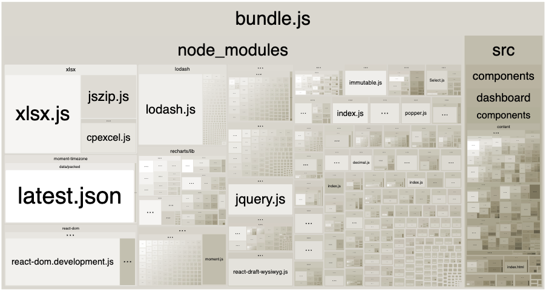

## 문제상황

전월세 실거래가 공공데이터를 활용한 지도 서비스([대방](https://dae-bang.vercel.app/onetwo?lat=37.49436732800421&lng=127.01446798508894&region=11650))은 [SPA](https://developer.mozilla.org/ko/docs/Glossary/SPA)(Single Page Application)로 설계되었다.

SPA란 하나의 HTML 페이지로 실행되는 웹 애플리케이션으로, 최초 페이지 로딩 후 JavaScript를 통해 동적으로 페이지 내용을 갱신한다. 따라서, 동적이고 사용자와 상호작용이 많은 앱을 구현하는데 적절하지만, 처음 접속시 모든 JavaScript를 파일을 다운로드 해야함으로 첫 페이지 로딩이 오래걸리는 것이 단점이다. 특히 지도 서비스인 대방은 [외부 지도API](https://apis.map.kakao.com/)를 불러오는데 추가적인 시간이 소요되므로, 초기 로딩을 단축하여 [웹 성능](https://developer.mozilla.org/ko/docs/Web/Performance)(Web Performance)를 향상시키는 것이 관건이었다.

## 번들링 (Bundling)

개발자가 코드를 `import` 문법이나 `require` 문법을 사용하여 모듈화하여 코드를 작성하면, Webpack과 같은 번들러는 이를 빌드타임에 읽고 해석하여 여러 파일을 하나로 병합한 하나의 번들 파일을 만든다.

번들링 전

```js
// app.js
import { add } from './math.js';

console.log(add(16, 26)); // 42
```

```js
// math.js
export function add(a, b) {
  return a + b;
}
```

번들링 후

```js
// bundle.js

function add(a, b) {
  return a + b;
}

console.log(add(16, 26)); // 42
```

사용자가 SPA로 만든 웹에 접속시, 브라우저는 모든 애플리케이션에 필요한 코드가 담긴 `bundle.js`(파일이름은 다를 수 있다.)를 다운받는다. 번들러로 [webpack](https://webpack.kr/)을 사용중이라면 [webpack bundle analyzer](https://www.npmjs.com/package/webpack-bundle-analyzer)같은 플러그인을 통해 번들링된 파일을 시각적으로 분석할 수 있다.



## 코드 분할(Code Splitting)

초기 번들사이즈를 줄이고 나중에 필요한 코드들은 분할하여 그때 로드받는 것을 코드 분할이라고 한다. 이를 통해 웹 성능을 개선할 수 있다. [동적 모듈 불러오기](https://ko.javascript.info/modules-dynamic-imports)를 통해 내 컴포넌트가 마운트 되었을때 다른 컴포넌트를 불러올 수 있다.

```tsx
import { useState, useEffect } from 'react';

function MyComponent() {
  const [OtherComponent, setOtherComponent] = useState(null);
  const [isLoading, setIsLoading] = useState(true);

  useEffect(() => {
    // 동적으로 컴포넌트 import
    import('./OtherComponent')
      .then((module) => {
        setOtherComponent(() => module.default);
        setIsLoading(false);
      })
      .catch((error) => {
        console.error('컴포넌트 로딩 실패:', error);
        setIsLoading(false);
      });
  }, []);

  if (isLoading) {
    return <div>Loading...</div>;
  }

  if (!OtherComponent) {
    return <div>컴포넌트를 불러오는데 실패했습니다</div>;
  }

  return (
    <div>
      <OtherComponent />
    </div>
  );
}

export default MyComponent;
```

이렇게 동적 모듈 불러오기를 사용해 코드를 작성하면, 번들러는 해당 파일과 그 의존성을 별도의 청크로 분리한다.

```plaintext
dist/
  ├── main.js            // 메인 번들
  └── chunk-123.js       // OtherComponent와 그 의존성
```

이를 [`lazy()`](https://ko.react.dev/reference/react/lazy)함수와 [`<Suspense/>`](https://ko.react.dev/reference/react/Suspense) 컴포넌트를 사용하면 더 쉽게 구현할 수 있다.

```tsx
import { lazy, Suspense } from 'react';

const OtherComponent = lazy(() => import('./OtherComponent'));

function MyComponent() {
  return (
    <div>
      <Suspense fallback={<div>Loading...</div>}>
        <OtherComponent />
      </Suspense>
    </div>
  );
}
```

모듈을 뒤늦게 로드할 때 네트워크 장애 같은 이유로 에러가 발생할 수 있다. 이때, [ErrorBoundary](https://ko.legacy.reactjs.org/docs/error-boundaries.html)를 통해서 에러를 처리할 수 있다.

```tsx
import { lazy, Suspense } from 'react';
import MyErrorBoundary from './MyErrorBoundary';

const OtherComponent = lazy(() => import('./OtherComponent'));
const AnotherComponent = lazy(() => import('./AnotherComponent'));

const MyComponent = () => (
  <div>
    <MyErrorBoundary>
      <Suspense fallback={<div>Loading...</div>}>
        <section>
          <OtherComponent />
          <AnotherComponent />
        </section>
      </Suspense>
    </MyErrorBoundary>
  </div>
);
```

## 코드분할을 언제 사용해야할까?

앱에 코드 분할을 어느 곳에 도입할지 결정하는 것은 조금 까다롭다. 애써 번들러가 하나로 번들링한 모듈들을 모두 다시 분할한다면 어리석은 일일 것이다. 적절한 곳에 도입해야한다.

동시에, 코드분할은 공짜가 아니다. 이는 초기로딩을 줄이는 대신 이후의 로딩을 추가하는 것이다. 개발자는 충분히 이후의 로딩을 납득할수 있을때만 코드분할을 적용해야 한다.

코드분할을 사용하기 좋은 세가지 예시는 다음과 같다.

1.  **라우트 기반 분할** : 새 페이지로 이동할때 해당 페이지 모듈을 불러온다.

```tsx
import { Suspense, lazy } from 'react';
import { BrowserRouter as Router, Routes, Route } from 'react-router-dom';

const Home = lazy(() => import('./routes/Home'));
const About = lazy(() => import('./routes/About'));

const App = () => (
  <Router>
    <Suspense fallback={<div>Loading...</div>}>
      <Routes>
        <Route path="/" element={<Home />} />
        <Route path="/about" element={<About />} />
      </Routes>
    </Suspense>
  </Router>
);
```

2.  **모달/다이얼로그 분할** : 사용자가 모달열기 버튼을 클릭할때 모달 모듈을 불러온다.

```tsx
import { Suspense, lazy } from 'react';

const HeavyModal = lazy(() => import('./HeavyModal'));

function App() {
  const [showModal, setShowModal] = useState(false);

  return (
    <div>
      <button onClick={() => setShowModal(true)}>모달 열기</button>
      {showModal && (
        <Suspense fallback={<LoadingSpinner />}>
          <HeavyModal onClose={() => setShowModal(false)} />
        </Suspense>
      )}
    </div>
  );
}
```

3.  **조건부 기능 분할** : 사용자가 어드민인 경우에만 어드민 패널 모듈을 불러온다.

```jsx
import { Suspense, lazy } from 'react';
const AdminPanel = lazy(() => import('./AdminPanel'));

function App() {
  return (
    <div>
      {user.isAdmin && (
        <Suspense fallback={<LoadingSpinner />}>
          <AdminPanel />
        </Suspense>
      )}
    </div>
  );
}
```

코드 분할을 적용하기 좋은 경우

- 사용자가 즉시 필요로 하지 않는 큰 컴포넌트
- 특정 조건(예: 관리자)에서만 사용되는 기능
- 라우트별로 독립적인 큰 기능
- 무거운 서드파티 라이브러리를 사용하는 컴포넌트
- 모달이나 팝업처럼 사용자 인터랙션으로 열리는 UI

피해야 할 경우

- 자주 사용되는 작은 컴포넌트
- 페이지 초기 로딩에 꼭 필요한 컴포넌트
- 너무 잦은 코드 분할로 인한 네트워크 요청 증가
- 사용자 경험을 해칠 수 있는 중요한 UI 요소

## 후기

대방에 페이지별 코드분할과 모달관련 컴포넌트를 분할한 결과, 초기 번들사이즈를 10% 감소시킬 수 있었다. 페이지별 코드와 모달관련 코드가 크지 않았기 때문에, 체감할만한 성능개선 결과는 없었다.

의외로, 라이트하우스 점수를 크게 상승시켜주고 체감할만한 UX 향상시킬 수 있었던 것은 데이터 로딩 시 적절한 로딩중 화면을 보여주는 것이었다. 이를 통해 페이지가 로드될때 화면에서 가장 큰 콘텐츠 요소(이미지 or 텍스트)가 렌더링 될 때까지 걸리는 시간인 LCP(Largest Contentful Paint)를 줄일수 있었다.

이를 통해서 **선제적인 성능 최적화보다는 성능 최적화가 필요한 상황에서 그 원인을 파악하고 그에 맞는 방법을 도입하는 것이 적절하다**는 교훈을 얻을 수 있었다.

## 참고자료

[추천 아티클 1 Webpack Bundle.js 파일 성능개선](https://drhot552.github.io/web/Bundle.js%ED%8C%8C%EC%9D%BC-%EC%84%B1%EB%8A%A5%EA%B0%9C%EC%84%A0%ED%95%98%EA%B8%B0/#)

[추천 아티클 2 Next.js에서 코드분할](https://medium.com/@farihatulmaria/what-is-code-splitting-in-next-js-how-does-it-improve-performance-bccd4c8eda58)

[추천 아티클 3 라이트하우스와 함께한 성능개선 고군분투기](https://velog.io/@edie_ko/lighthouse-performance#1-data-fetching-%EB%B0%A9%EC%8B%9D-%EB%B3%80%EA%B2%BD)
