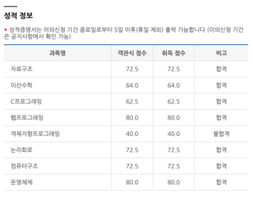

[학점은행제](https://www.cb.or.kr/)로 컴퓨터공학 학위를 취득하기 위해 [독학학위제](https://bdes.nile.or.kr/) 전공기초과정(독학사 2과정) 시험에 응시했다. 학위 취득 과정을 기록하고, 시험을 준비하는 분들께 도움이 될 만한 정보를 공유하고자 후기를 작성해본다.

## 결과

약 2주간 하루 1~2시간을 투자해 8과목 중 7과목에 합격했다.

## 공부방법

기초 지식으로는 이전에 정보처리기사 자격증을 준비하고 코딩 테스트를 연습했던 경험이 있었다.

교재는 [시대에듀 독학사 컴퓨터공학과 2단계 6과목 벼락치기](https://ebook-product.kyobobook.co.kr/dig/epd/ebook/E000011101600) (ebook, 18,900원) 을 선택했다. ebook으로 구매해 주로 태블릿으로 학습했고, 이동 중에는 스마트폰을 활용했다. 이해가 어려운 부분은 여러 유튜브 강의 영상을 참고하며 보충했다.

시험문제는 대부분 교재의 문제와 비슷하게 나오는 것 같다. 교재에 나온 기출문제와 연습문제를 쉽게 풀 수 있다면 가볍게 합격할 수 있어 보인다.

다만 해당 교재는 전체 8과목 중 6과목만 다루고 있어, 포함되지 않은 웹 프로그래밍과 객체지향 프로그래밍은 과목은 별도 학습 없이 시험에 응시했다. (만약, 구글링을 해보시면 학습자료를 얻으실 수도?)

## 과목별 정보 및 체감 난이도

과목당 4지선다 문항 40문제가 출제. 100점 만점에 60점 이상이면 합격. (단, 이산수학은 25문제)

100분동안 2과목을 응시하며, 시험 시작 30분 경과 후 조기퇴실이 가능.(난 검토안하고 평균적으로 40분 쯤에 퇴실했다.)

- **C프로그래밍:** 간단한 프로그래밍
- **객체지향 프로그래밍:** 기초 이론 및 C++, Java 문법
- **웹프로그래밍:** 기초 HTML, CSS, JavaScript
- **자료구조, 논리회로, 컴퓨터구조, 운영체제, 이산수학:** 기초 지식

### 체감 난이도(쉬움 ~ 어려움)

웹 프로그래밍 < C프로그래밍 논리회로, 자료구조, 컴퓨터구조, 운영체제 < 이산수학 < 객체지향 프로그래밍

### 추천 공부순서

C프로그래밍, 논리회로, 웹 프로그래밍 -> 자료구조 -> 이산수학, 컴퓨터 구조 -> 운영체제 → 객체지향 프로그래밍

## 팁

- **겹치는 부분이 많으므로 일단 공부하기 :** 처음에는 개념이 낯설더라도 여러 과목을 공부하면 반복되는 부분이 많으므로 도움이 되는 부분이 많다.
- **모든 과목 신청하기 :** 일부 과목만 응시할 필요한 경우가 아니라면, 가급적 모든 과목에 응시하는 것을 권장한다. 기본적인 지식만으로 합격하는 과목이 생길 수 있다. 나도 별도로 학습하지 않은 웹 프로그래밍에 합격했고, 학습량이 적었던 이산수학도 합격했다.
- **시험 당일 자투리 시간 활용하기** : 조기 퇴실이 가능하고 점심시간 등 중간에 시간이 많다. 시험장에도 공부할거리를 챙겨가서 마지막까지 보는 것을 추천한다.
- **자신만의 기준 세우기 :** 인터넷 후기의 몇일 전사같은 학습 시간에 얽매이기 보다는, 스스로 만족할 수 있을 때까지 학습하는 것을 추천한다. 나 또한 공부를 조금 더 할 걸 하는 아쉬움이 남았다.
- **시험일정 확인하기** : 각 과정 별로 1년에 시험이 1번이기 때문에, 혹시 독학학위제로 학점을 취득하는 것에 관심이 있다면 미리 시험일정을 확인할 것을 권장한다.

### 2025년 시험일정

| 과정        | 교양과정(1과정) | 전공기초과정(2과정) | 전공심화과정(3과정) | 학위취득(4과정) |
| ----------- | --------------- | ------------------- | ------------------- | --------------- |
| 원서접수    | 1월             | 4월                 | 7월                 | 10월            |
| 시험일      | 2월             | 5월                 | 8월                 | 11월            |
| 합격자 발표 | 3월             | 6월                 | 9월                 | 12월            |
