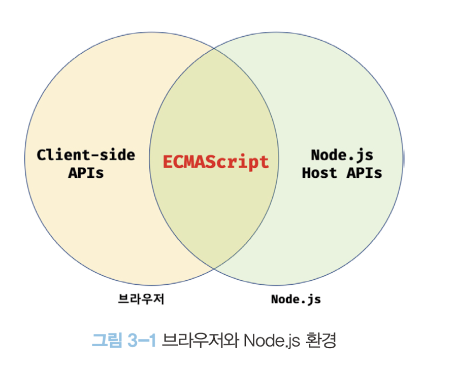

## 문제상황

Next.js에서 페이지 인증 인가 기능 구현을 위해 [미들웨어](https://nextjs.org/docs/pages/building-your-application/routing/middleware)에서 [`jsonwebtoken`](https://www.npmjs.com/package/jsonwebtoken) 모듈을 사용하려고 했다.

```
Error: The edge runtime does not support Node.js 'crypto' module.
Learn More: https://nextjs.org/docs/messages/node-module-in-edge-runtime
```

## 원인

Next.js 에서 미들웨어는 Node.js환경이 아닌 [엣지 런타임](https://nextjs.org/docs/app/building-your-application/rendering/edge-and-nodejs-runtimes) 환경에서 돌아간다. 엣지 런타임 환경이란 Next.js에서 제공하는 경량화된 실행 환경이며, 일부 Node.js API만을 지원한다. 이는 미들웨어가 모든 요청을 가로채고 처리하는 만큼, 가능한 빠르고 가벼워야 함을 고려한 것이다.

`jsonwebtoken` 모듈은 Node.js의 [`crypto API`](https://nodejs.org/api/crypto.html#crypto)를 사용하는데, 엣지 런타임 환경에서는 이를 지원하지 않기 때문에 다음과 같은 에러가 발생한 것이다.

## 해결방법

jwt 파싱에 node.js모듈 `crypto`를 사용하는 `jsonwebtoken` 을 웹 표준인 Web Crypto API를 사용하는 `jose` 모듈을 사용했다. `jose` 는 웹 표준인 [`Web Crypto API`](https://developer.mozilla.org/en-US/docs/Web/API/Web_Crypto_API)를 사용하므로 엣지 런타임, 브라우저, Node.js 등 다양한 환경에서 실행 가능하다.



## 후기

Next.js같은 풀스택 프레임워크로 JavaScript 코드를 작성할 때 , **현재 작성하는 코드가 어느 환경(서버 또는 클라이언트)에서 실행되는지 주의해야한다**고 느낄수 있었다.
