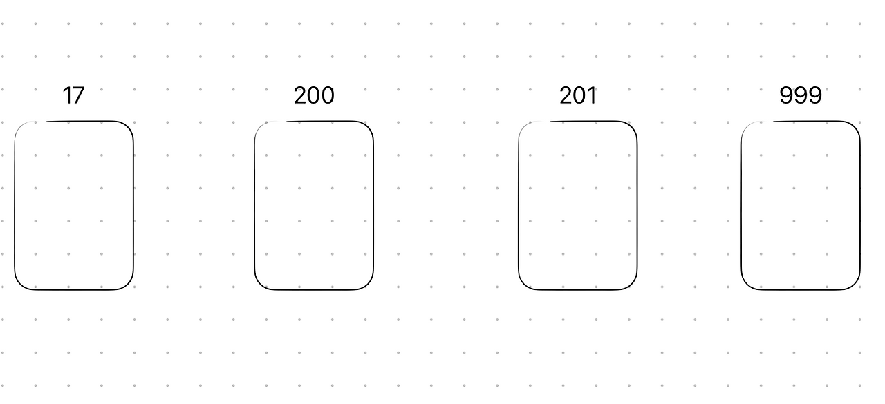

음악 인기도 맞추기 게임 [스포티게서](https://spoti-guessr.chaesunbak.com/)를 개발하면서, DB에서 랜덤한 요소를 가져올 필요가 있었다. 두가지 랜덤한 요소 중 인기도가 높은 요소를 맞추는 게임이었기 때문이다. 단순해 보이는 "랜덤"이라는 개념 뒤에 숨겨진 기술적 고민과 해결 과정을 공유하고자 한다. 스포티게서는 NoSQL DB인 파이어베이스의 파이어스토어를 사용했기에 컬렉션과 문서라는 용어를 사용하지만, 관계형 DB의 테이블과 행으로 대체하여 이해해도 무방하다.

## 가장 쉬운 방법, 하지만…

1.  컬렉션의 총 문서갯수 가져오기 (예 : 350개)
2.  총 문서갯수 내에서 랜덤한 숫자 생성하기 (예 : 1~350중에 아무 숫자 → 53)
3.  해당 번호의 문서 가져오기 (예 : 53번째 문서 불러오기)

위 방법은 가장 직관적으로 떠올릴 수 있는 방법이지만, 심각한 단점이 존재한다. **컬렉션의 총 문서 개수를 확인하기 위해 모든 문서에 접근해야 하므로, 읽기 비용이 과도하게 발생한다**는 점이다. 특히, SaaS인 파이어스토어는 읽기 작업에 따라 비용이 청구되므로, 잦은 랜덤 요소 추출은 곧 비용 문제로 직결될 수 있다.

## 랜덤 인덱스 활용법: 효율적인 대안

따라서, 위의 비용 문제를 해결하기 위해 문서 생성 시 고유한 랜덤 숫자 필드를 추가하는 방식을 도입했다. 랜덤 숫자는 32비트 정수 범위 내에서 생성되도록 설정했다. 랜덤 요소를 불러올 때는, 해당 범위 내에서 임의의 숫자를 생성한 후, **랜덤 숫자 필드 값이 생성된 숫자와 일치하거나 가장 가까운 문서를 조회**하는 방식으로 구현했다.

아래 참고자료를 구글링으로 찾을 수 있었고, 매우 잘 정리되어있어서 큰 도움을 받았다.

[참고자료 1 : Firestore : How to get random documents in a collection](https://stackoverflow.com/questions/46798981/firestore-how-to-get-random-documents-in-a-collection)

객체 생성 시 랜덤 번호를 부여하고 이를 활용하는 방식은 게임, 추천 알고리즘 등 다양한 분야에서 널리 사용되는 효율적인 기법이라고 한다.

## 이거 진짜 랜덤한거 맞아?

**그런데 서비스를 테스트해보면서 몇몇 요소가 다른 요소들보다 더 자주 등장하는 느낌을 받았다.** 과연 위 방식은 정말 랜덤할까? 이러한 의문을 해소하고 검증 및 보완할 필요성을 느꼈다.

### 그림으로 더 쉽게 이해하기

랜덤 인덱스 방식의 동작 원리를 카드에 비유하여 그려보면 다음과 같다. 각 문서 생성 시 랜덤 숫자가 부여되고, 이 숫자를 기준으로 문서가 정렬된 카드 덱과 유사하다고 생각할 수 있다.

위 그림처럼 컬렉션에 4개의 문서가 있고, 0번부터 999번까지의 랜덤 숫자를 사용한다고 가정해 보자. 랜덤 문서를 가져오기 위해 0부터 999 사이의 랜덤 숫자를 하나 선택한다. 만약 17이 선택되었다면, 17 랜덤 인덱스를 가진 문서를 가져온다. 여기서는 첫번째 문서이다. 만약 18이 선택되었다면, 랜덤 인덱스가 18보다 크거나 같은 문서들 중 첫번째 문서인 두번째 문서를 선택한다.

이때, 모든 문서가 뽑힐 확률은 동일할까? 아니다. **해당 그림에서 각 문서가 선택될 확률은 동일하지 않다.** 문서 생성 시 랜덤 숫자가 무작위로 부여되었고, 문서들을 이에 따라 이미 배치되었다. 따라서 어떤 문서는 어떤 문서는 널널하게, 어떤 문서는 촘촘하게 놓아진 상태이다. 널널하게 놓아진 문서들은, 빽빽하게 놓아진 문서들보다 넓은 영역을 차지하게 되고 선택될 확률이 높다. 넓은 영역을 가진 문서 (예: 문서 2)는 좁은 영역을 가진 문서 (예: 문서 4)보다 선택될 확률이 높다. 또한, 낮은 확률로 문서 간 랜덤 숫자 값이 겹치는 경우, 해당 문서는 영원히 선택되지 않을 수도 있다.

이러한 방식을 과연 "랜덤"하다고 말할 수 있을까? **어떤 문서가 더 자주 뽑힐지는 랜덤하게 결정되지만, 일단 결정된 후에는 문서의 분포가 고정되어 편향이 발생할 수 있다.** 진정한 랜덤성을 검증하고 확보하기 위해서는 위와 같은 수학적 원리 분석과 함께 실제 통계 기반의 사후 검증이 필요하다.

## 더 랜덤하게 만들기

### 1\. 문서를 충분히 추가하기

문서 수가 충분히 많지 않으면 랜덤성이 떨어질 수 있다. 하지만 문서 수를 늘리면, 숫자 범위 내에서 문서 밀도가 높아지면서 빈 공간이 줄어들고, 각 문서가 선택될 확률이 더욱 균등해지는 효과를 기대할 수 있다. 위 그림에서 문서가 훨씬 많아진다면, 빈 공간이 줄어들면서 각 문서가 커버하는 숫자 범위가 비슷해질 것이다. 다만 너무 촘촘해지는 경우 렌덤 인덱스가 겹치는 문제가 발생할 수 있으므로, 전체 데이터의 갯수에 맞게 랜덤 인덱스의 범위를 알맞게 설정해야한다.

### 2\. 랜덤 인덱스를 여러개 사용하기

하나의 랜덤 인덱스 대신 여러 개의 랜덤 인덱스 필드를 사용하는 것은 랜덤성을 높이는 효과적인 방법이다. 카드 덱 비유를 다시 활용하면, 하나의 카드 덱 대신 여러 개의 카드 덱을 준비해두고, 랜덤하게 덱을 선택한 후 해당 덱에서 랜덤 카드를 뽑는 것과 같다. 각 랜덤 인덱스마다 문서의 정렬 방식이 달라지므로, 선택될 수 있는 문서의 다양성을 확보할 수 있다.

### 3\. 랜덤 인덱스를 주기적으로 교체하기

랜덤 인덱스를 주기적으로 갱신하여 랜덤성을 개선할 수 있다. 문서 읽기 시마다 랜덤 인덱스를 재부여하는 방법도 고려할 수도 있지만, 쓰기 횟수를 줄이기 위해서 문서 업데이트 시 랜덤 인덱스를 새롭게 생성하도록 구현했다. 또는 전체 문서에 주기적으로 렌덤 인덱스를 주기적으로 교체해줄 수도 있다. 이는 카드 덱의 카드 순서를 주기적으로 섞어주는 것과 유사하다. 인덱스 갱신 주기를 적절히 설정하면, 문서 선택 확률 분포를 주기적으로 재조정하여 장기적인 랜덤성을 확보할 수 있다.

## 후기

랜덤이라는 개념이 간단해보이지만, 이를 실제로 구현하는 것은 까다롭다고 느낄 수 있었다. 만약, 정리된 내용이 조금 어렵다면 맨 처음 언급된 가장 쉬운 방법으로 먼저 구현하고, 이후에 성능이나 비용을 최적화할 필요가 생긴 경우에 랜덤 인덱스를 활용하는 방법으로 리팩토링해도 좋을 것 같다.
