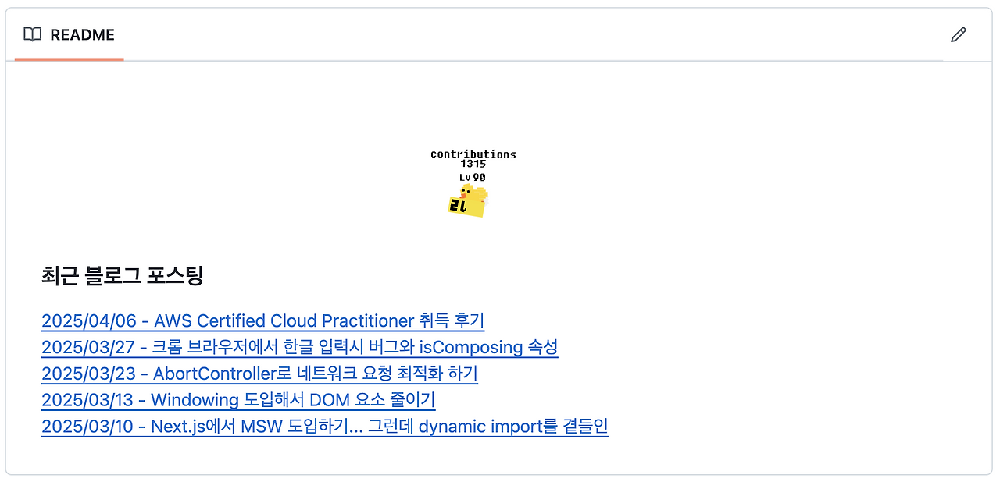
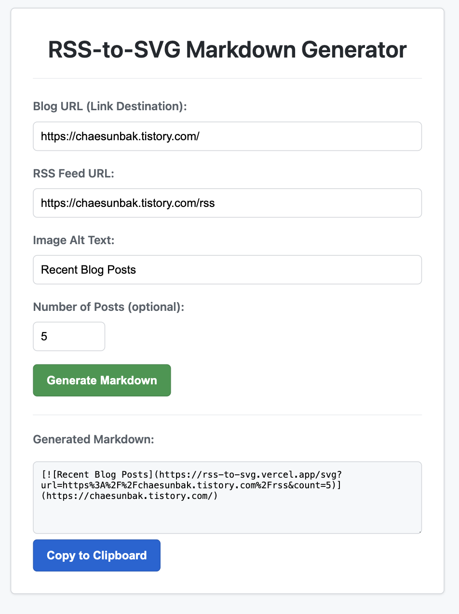
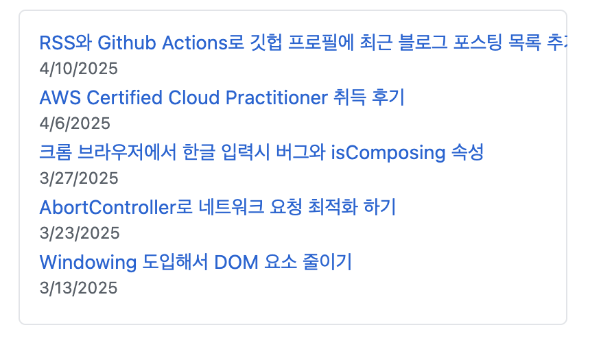

GitHub에서는 사용자 이름으로 된 레포지토리의 `README.md` 파일을 통해 자신을 효과적으로 소개할 수 있다. 많은 개발자들이 최근 블로그 포스팅 목록을 프로필에 표시하여 자신의 생각을 공유하고 블로그를 홍보하는 것을 보고, 나도 내 프로필에 최근 블로그 포스팅 목록을 추가하고 싶었다.

이 글에서는 RSS 피드와 GitHub Actions를 활용하여 GitHub 프로필 README에 최신 블로그 글 목록을 자동으로 업데이트하는 방법을 직접 경험하고 적용한 과정을 공유하고자 한다.

## RSS란?

[RSS](https://ko.wikipedia.org/wiki/RSS) (Really Simple Syndication 또는 Rich Site Summary)는 웹사이트의 새로운 콘텐츠 업데이트를 컴퓨터가 읽기 쉬운 표준화된 형식으로 제공하는 **웹 피드**이다.

대부분의 블로그 플랫폼(Tistory, Velog, Medium 등)은 RSS 피드를 제공한다. 티스토리는 [https://chaesunbak.tistory.com/rss](https://chaesunbak.tistory.com/rss), velog는 [https://v2.velog.io/rss/chaesunbak](https://v2.velog.io/rss/chaesunbak) 을 통해 RSS에 접근할 수 있다.

사용자는 RSS 리더(RSS 구독기 또는 피드 리더)를 사용하여 관심 있는 웹사이트의 RSS 피드를 구독할 수 있다. RSS 리더는 주기적으로 RSS 피드를 확인하여, 기존의 RSS 피드 데이터와 비교하는 방식으로 새로운 컨텐츠를 식별하고, 새로운 콘텐츠가 올라오면 새 콘텐츠를 표시하고 알림을 보낸다.

2010년대 이후 소셜 미디어의 부상으로 RSS의 사용이 줄어들긴 했지만, 여전히 뉴스, 블로그 등의 콘텐츠 배포에 유용하며, 특히 웹사이트의 최신 컨텐츠를 프로그래밍 방식으로 가져오는데 매우 효과적이다.

## Github Actions란?

[**GitHub Actions**](https://github.com/features/actions)는 GitHub에서 직접 제공하는 **워크플로우 자동화 플랫폼**이다. 코드 푸시, 풀 리퀘스트 생성, 정해진 시간 등 특정 이벤트(Event)가 발생했을 때 미리 정의된 작업(Job)들을 자동으로 실행한다. 주로 CI/CD(지속적 통합/지속적 배포) 파이프라인 구축에 많이 사용되지만, 이번 경우처럼 다양한 자동화 작업을 구현하는 데 활용될 수 있다.

## 파이썬 스크립트 작성하기

GitHub Actions는 다양한 프로그래밍 언어와 쉘 스크립트를 지원한다. 나는 기존 레퍼런스가 풍부한 Python으로 스크립트를 작성했다.

1.  기존 `README.md` 파일에 최근 블로그 포스팅 목록 영역 추가하기

먼저, `README.md` 파일에 주석을 통해 파이썬 스크립트가 최신 블로그 글 목록을 추가할 부분을 지정해준다.

```
...(기존 리드미 파일 내용)..

<!-- LATEST-BLOG-POST-LIST:START -->
<!-- LATEST-BLOG-POST-LIST:END -->

...(기존 리드미 파일 내용)..
```

2.  파이썬 스크립트 파일 작성하기

프로젝트 루트 디렉토리에 `update_readme.py` 파일을 생성하고 다음 코드를 작성한다.

```python
#update_readme.py
import feedparser, time

URL = "https://example.com/rss"
RSS_FEED = feedparser.parse(URL)
MAX_POST = 5
README_FILE = "README.md"

START_MARKER = "<!-- LATEST-BLOG-POST-LIST:START -->"
END_MARKER = "<!-- LATEST-BLOG-POST-LIST:END -->"

def update_readme_with_blog_posts():
    """README.md 파일에서 최신 블로그 포스트 목록을 업데이트합니다."""
    try:
        with open(README_FILE, "r", encoding="utf-8") as f:
            readme_content = f.readlines()
    except FileNotFoundError:
        print(f"Error: {README_FILE} 파일을 찾을 수 없습니다.")
        return

    start_marker_index = -1
    end_marker_index = -1

    for i, line in enumerate(readme_content):
        if START_MARKER in line:
            start_marker_index = i
        elif END_MARKER in line:
            end_marker_index = i
            break

    if start_marker_index == -1 or end_marker_index == -1 or start_marker_index >= end_marker_index:
        print("Error: README.md 파일에서 올바른 주석 마커를 찾을 수 없습니다.")
        return

    blog_posts_markdown = "### 최근 블로그 포스팅\n"
    for idx, feed in enumerate(RSS_FEED['entries']):
        if idx >= MAX_POST:
            break
        else:
            feed_date = feed['published_parsed']
            formatted_date = time.strftime('%Y/%m/%d', feed_date) if feed_date else "날짜 정보 없음"
            markdown_text = f"[{formatted_date} - {feed['title']}]({feed['link']}) <br/>\n"
            blog_posts_markdown += markdown_text

    updated_readme_content = (
        readme_content[: start_marker_index + 1]
        + [blog_posts_markdown]
        + readme_content[end_marker_index :]
    )

    with open(README_FILE, "w", encoding="utf-8") as f:
        f.writelines(updated_readme_content)
    print("README.md 파일이 최신 블로그 포스트로 업데이트되었습니다.")

if __name__ == "__main__":
    update_readme_with_blog_posts()
```

## 워크플로우 작성하기

이제 Python 스크립트를 자동으로 실행시킬 GitHub Actions 워크플로우를 설정해준다.

프로젝트 루트에 `.github/workflows` 디렉토리를 생성하고, 그 안에 `update_readme.yml` (또는 원하는 이름) 파일을 만들어 아래 내용을 작성한다.

```yml
//.github/workflows/python-app.yml
name: Update README with Latest Blog Posts

on:
  push:
    branches: [ "main" ]
  pull_request:
    branches: [ "main" ]
  schedule:
      - cron: "0 0 */1 * *"

jobs:
  build:
    runs-on: ubuntu-latest
    permissions:
      contents: write
    steps:
    - uses: actions/checkout@v3
    - name: Set up Python 3.10
      uses: actions/setup-python@v3
      with:
        python-version: "3.10"
    - name: Install dependencies
      run: |
        python -m pip install --upgrade pip
        pip install feedparser
    - name: Run Update Python Script
      run: |
        python update_readme.py
    - name: Commit and Push Changes
      run: |
        git config --local user.name 'github-actions[bot]'
        git config --local user.email 'github-actions[bot]@users.noreply.github.com'
        git add README.md
        # README.md 파일에 변경 사항이 있는지 확인
        if [[ -n $(git status --porcelain README.md) ]]; then
          git commit -m "Update README with latest blog post"
          git push
        else
          echo "No changes to README.md, skipping commit and push."
        fi
```

## 결과



기존 레퍼런스 대비 개선사항

- 주석을 통해 변경할 부분을 지정하고 해당 부문만 변경하므로 재사용성이 높음.
- 매일 자정에 실행되는 데, 새 블로그 포스팅이 없어 깃 변경사항이 없는 경우 워크플로우가 RUN FAIL 하였는데, git push 전에 조건문을 추가하여 이를 방지하였음.

## 참고자료

[참고자료 1 : 개발자 두더지의 일지 : Profile Readme 꾸미기 - 블로그 최신 글 추가하기 (2)](https://jjrdd.tistory.com/83)

[참고자료 2 : 주현태 : Github README 하단에 내 최신 블로그 글 올라오게 하기](https://honeyinfo7.tistory.com/328)

## 간단한 프로젝트 해보기 : RSS-to-SVG Markdown Generator



이렇게 간단한 작업을 해보면서 더 간단한 방법은 없나 생각이 들었다. 그러다 문득 깃허브 프로젝트의 스타 추세를 보여주는 [Github Star History](https://www.star-history.com/blog/how-to-use-github-star-history) 같이 내 블로그의 RSS 주소를 입력하면 최근 블로그 포스팅 목록을 생성해주는 프로젝트를 아이디어가 떠올랐다. 혹시 이미 이러한 프로젝트에 있었는지 검색해보고 없길래, 잽싸게 Express + JavaScript로 코드를 작성해주었다.

처음에는 RSS 주소를 쿼리 파라미터로 받아서 HTML을 만들어서, 사용자가 `iframe` 태그 하나만 추가하면 간편하게 최근 포스팅 목록을 임베딩할 수 있게 하려고 했으나, Github 정책으로 `iframe`은 허용되지 않아 불가했다. 따라서, **RSS 주소를 쿼리 파라미터로 받아서 SVG를 동적으로 만들어 이미지를 활용하도록 해보았다.** 다만, 이러한 방식은 개별 포스팅을 선택했을 때 해당 포스팅으로 이동하도록 하는 것이 불가능하다는 단점이 있었다.

[깃헙 링크](https://github.com/chaesunbak/rss-to-svg)

### 결과

1.  **루트 경로 (/)**:
2.  서비스의 메인 페이지로, 사용자가 RSS 피드 주소 등을 입력하면 GitHub README에 바로 붙여넣을 수 있는 마크다운 코드(\[!\[alt text\](SVG 이미지 URL)\](블로그 URL))를 생성해줍니다.
3.  **SVG 생성 경로 (/svg)**:
4.  URL 인코딩된 RSS 피드의 주소를 쿼리 파라미터로 받아, 해당 RSS 피드를 rss-parser 라이브러리를 사용해 파싱하여 이를 기반으로 svg 이미지를 생성하여 반환합니다. GitHub README의
5.  태그 src 속성에 바로 이 경로의 URL을 사용하게 됩니다.



## 회고

AI Assistant 덕분에 Python과 YAML처럼 익숙하지 않은 언어로도 간단한 스크립트를 매우 쉽게 작성할 수 있는 것 같다.

GitHub Actions는 클라우드 컴퓨팅과 워크플로우를 무료로 경험할 수 있는 훌륭한 도구인 것 같다. 앞으로 다양한 방법으로 사용해보고 싶다.

우연이든 의도적이든 여러 것들을 보고 접하고 해보는것이 새로운 아이디어를 떠올리게 하는 것 같다.
