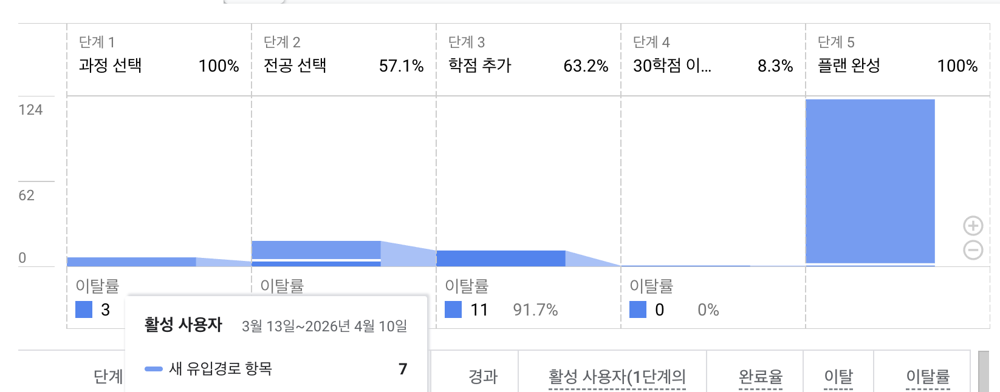
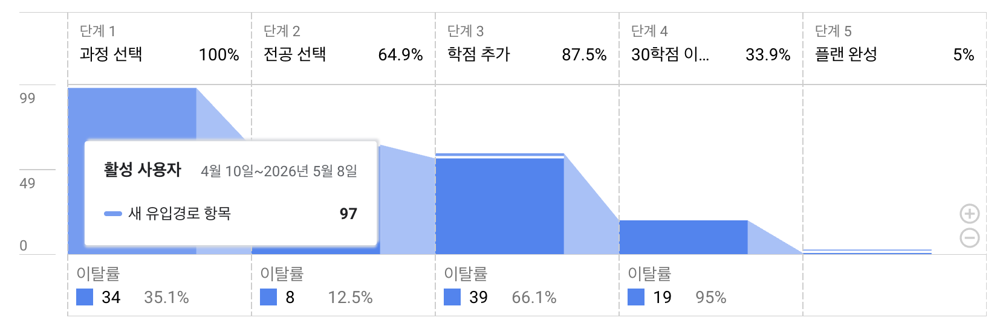

## 배경

서비스의 전환율 개선 사례를 소개하는 개발자 컨퍼런스 영상을 보고 큰 매력을 느꼈다.
데이터에 기반해서 의사결정을 내리고 기술과 협업으로 서비스를 개선에 이르는 것이 흥미로웠다.

따라서, 데이터 분석과 관련한 책을 몇개 추천받아서 읽어 보았다.
그 중 양승화의 [그로스 해킹](https://product.kyobobook.co.kr/detail/S000001766457)을 읽으며 북극성 지표라는 개념을 알게 되었고 이를 내 사이드 프로젝트에도 적용해보려고 했다.

## 북극성 지표란?

**북극성 지표란 고객이 제품에서 얻는 핵심 가치를 측정하고, 비즈니스의 장기적인 성장을 반영하는 단 하나의 핵심 지표를 말한다.** OMTM(One Metric That Matters)라고 부르기도 한다.
북극성 지표는 부서와 상관없이 전사적으로 모두 참조할 수 있는 지표라는 특징이 있다.

이에 반해 과업기반의 지표는 각 부서가 맡은 업무의 이행 여부를 확인하는데 초점을 맞춘다.
과업기반의 지표는 '성장'을 위해 활용되기 보다는 '우리는 놀지 않았다'는 것을 증명하는 수단이 될 위험이 있다.

_과업기반 지표_

- 개발
  - 신규 업데이트 횟수
  - 무장애율
- 마케팅
  - 신규 고객 유입 수
  - 광고 클릭 수

_북극성 지표_

- 에어비앤비: 예약된 숙박 일수
- 페이스북: 10일 안에 7명과 친구를 맺는 사용자의 수
- 넷플릭스: 유료 사용자의 콘텐츠 스트리밍 총 시간
- 스포티파이: 음악을 스트리밍 하는 총 시간

## 내 서비스의 북극성 지표 찾기

그렇다면, 내 사이드 프로젝트의 북극성 지표는 무엇일까?
처음에는 단순하게 MAU를 늘리는 것을 목표로 설정했다. MAU를 2배 늘려보자 생각하고 어설픈 신규 기능을 몇 개 추가했다.

이 과정에서 의문이 들었다. 과연 MAU가 내 서비스의 핵심 가치를 나타내는 지표일까?
MAU를 높이는게 목표라면, 내 서비스에 수박게임을 추가해도 늘지 않을까? 개발보다는 홍보에 집중해도 달성할 수 있지 않을까?

MAU는 내 서비스의 핵심 가치를 나타내지 못한다고 생각했고, 새로운 지표를 찾아야 한다고 생각했다.
**내 서비스는 혼자서도 학점은행제 플랜완성을 도와준다는 핵심 가치를 가지고 있으니 이에 맞게 '월간 플랜 완성 전환율'을 북극성 지표로 삼기로 했다.**

## 퍼널 보고서 만들기

사용자 시나리오에 맞게 이벤트를 측정 해주고 구글 애널리틱스로 퍼널 보고서를 만들어 주었다. 공유받은 플랜을 수정해서 완성하는 경우도 서비스 의도에 부합하다고 판단해서 개방형 퍼널로 설정해주었다. 플랜 저장 버튼 또는 공유 버튼을 누르는 경우를 플랜 완성으로 간주하기로 했다.

_3월 13일 ~ 4월 10일_

우선 생각보다 데이터 숫자가 적어서 충격 받았다.
약 1달간의 데이터의 모수가 10명이 되지 않아, 신뢰성이 떨어지고 A/B테스트도 어렵다고 판단했다.
이유는 알 수 없지만 새 유입경로 항목의 플랜 완성 이벤트가 많은데 이는 노이즈로 간주하기로 했다.

## 개선하기

전환율 지표 개선을 목표로 삼으니 무엇을 개발해야할지를 더 구체화할 수 있었다. 이전에는 '이런게 있으면 더 편하겠지'라고 추상적으로 접근했지만, 이제는 어떻게 하면 '특정 단계의 전환율을 개선할 수 있을까?', '단계를 줄일 방법은 없을까'?와 같은 체계적인 사고로 이어졌다.

다음과 같은 개선사항을 도출하고 지속적으로 업데이트 해주었다.

- 아이템 목록 탐색 개선
  - 셀렉터에서 모달로 변경
  - 추천 요소 우선 노출, 비추천 요소 접어진 상태로 제공
  - 카테고리별 필터 기능
  - 검색 로직 개선(별칭 검색, 띄어쓰기 무시 등)

- 진행 피드백 개선
  - 카테고리별 총 학점 노출
  - 사이드바에 진행율 표시

- 애니메이션
  - 학점 선택 애니메이션
  - 학점 추가 애니메이션

- 연속성 강화
  - 로컬스토리지를 사용한 자동저장

- 단계 건너뛰기
  - 추천 템플릿 제공

## 결과

4월 10일 ~ 5월 8일

초기에 빈약했던 데이터와 비교해서 각 단계별로 데이터 양이 크게 증가했다. 3월과 4월에 MAU 차이가 없었던 것을 고려하면 큰 성과로 보인다.

개선전 데이터 신뢰도가 매우 낮긴하지만 굳이 비교해 보자면, 3단계(63.2% -> 87.5%), 4단계(8.3% -> 33.9%)까지 도달하는 비율이 증가했다.

5월 초 까지 업데이트가 진행되었으므로. 개선 이후의 데이터를 더 정확하게 확인하려면 5~6월 데이터를 기다려봐야 할 것 같다.
