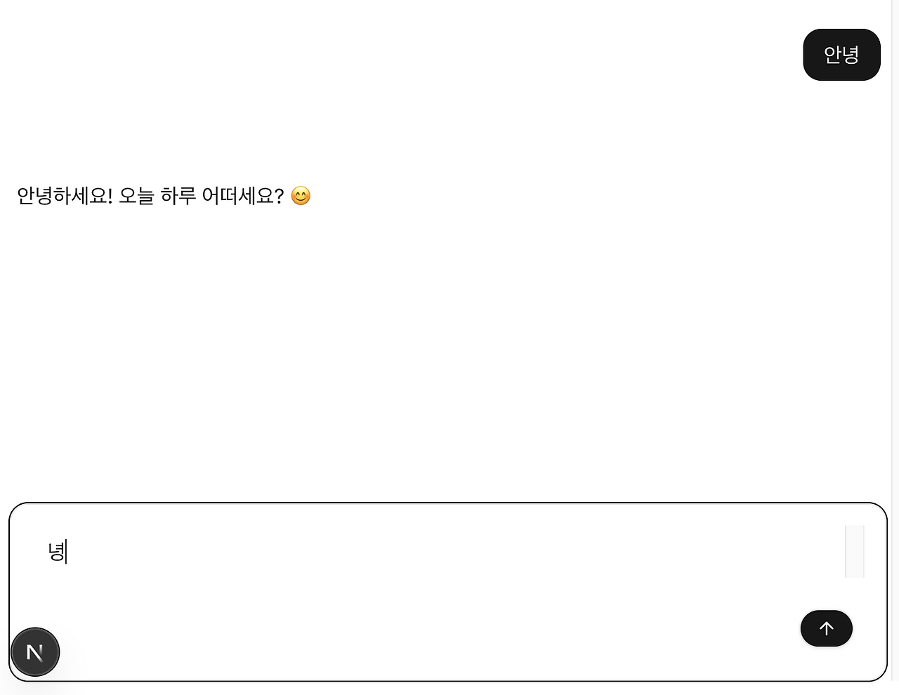
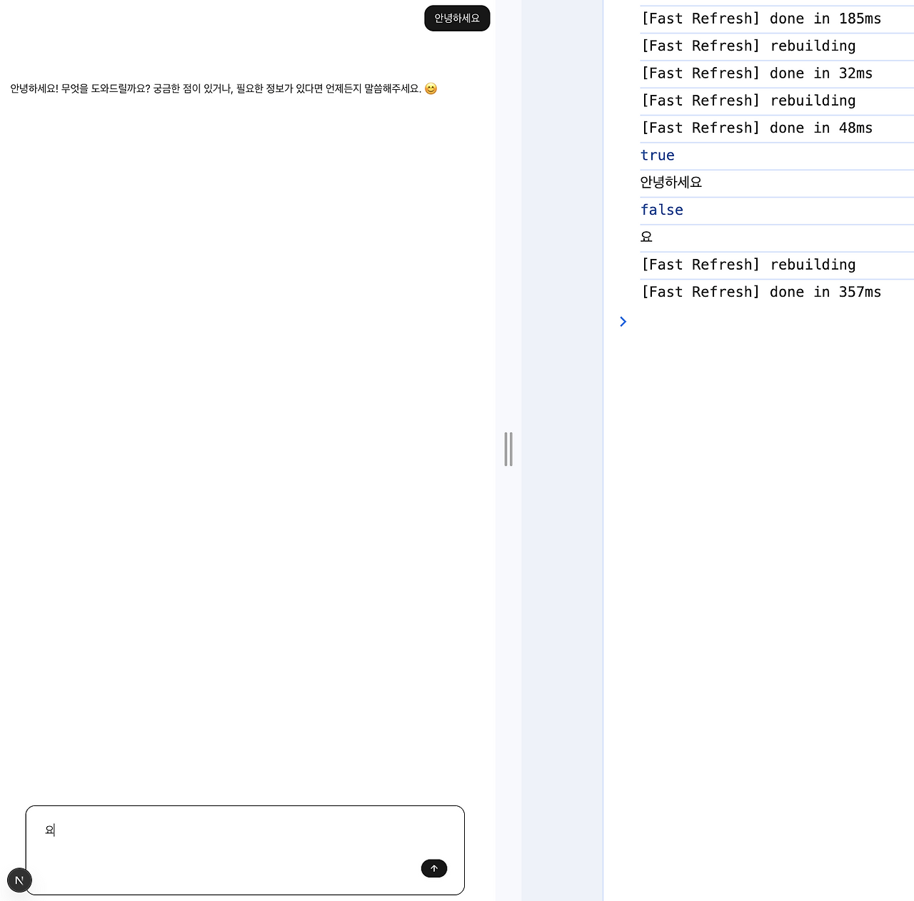

## 문제상황

`input`(또는 `textarea`)에서 `Enter` 키를 눌러 메세지를 보내는 코드를 작성했다. 그런데 한글을 입력하고 `Enter`를 누르면 마지막 글자가 남는 버그가 발생했다. 그런데, 기묘하게도 영어나 숫자를 입력했을 때는 이러한 버그가 발생하지 않았고, 제출 버튼을 눌러서 제출했을때도 버그가 발생하지 않았다. 따라서, 한글입력과 키보드 이벤트와 관련한 이슈로 파악할 수 있었다.

또한 이러한 이슈는 크롬 브라우저를 사용중인 경우에만 발생하였다.



구글 검색을 통해 관련 [이슈](https://github.com/vercel/ai-chatbot/issues/884)를 찾을 수 있었다.

## 코드 수정

수정전

```ts
const handleKeyDown = (e: KeyboardEvent<HTMLTextAreaElement>) => {
  if (e.key === 'Enter' && !e.shiftKey) {
    e.preventDefault();
    onSubmit(e as any);
  }
};

const submitForm = () => {
  handleSubmit();
  setInput('');
};
```

수정후

```ts
const handleKeyDown = (e: KeyboardEvent<HTMLTextAreaElement>) => {
  if (e.key === 'Enter' && !e.shiftKey && !e.nativeEvent.isComposin) {
    e.preventDefault();
    onSubmit(e as any);
  }
};

const submitForm = () => {
  handleSubmit();
  setInput('');
};
```

[`KeyboardEvent`](https://developer.mozilla.org/ko/docs/Web/API/KeyboardEvent)의 [`isComposing`](https://developer.mozilla.org/ko/docs/Web/API/KeyboardEvent/isComposing) 속성이 `false`인 경우에만 제출하도록 코드를 수정하여 버그를 수정했다.

## IME와 `isComposing`

**한 문자가 한 글자인 라틴 알파벳과는 달리, 한 글자가 여러 문자의 조합이나 변환을 거쳐 입력하는 문자들이 있다.** 대표적으로는, 한글, 가나, 한자 등이 있다. 이러한 키 입력을 사용자가 원하는 글자와 기호로 변환하는 기술을 [IME](https://www.notion.so/isComposing-1c2454a9244880ba826ad55ea61fbde7?pvs=21)(Input Method Editor, 입력기)라고 한다.

예를 들어, 한글로 '대한민국'을 입력하려면 'ㄷ → ㅐ → ㅎ → ㅏ → ㄴ → ㅁ → ㅣ → ㄴ → ㄱ → ㅜ → ㄱ' 순서로 키를 눌러야 한다. IME가 없다면 이 키 입력들을 '대한민국'이라는 단어로 조합할 수 없습니다. 하지만 IME는 한글 자모로 조합되어 만들어진 글자 데이터를 기반으로 'ㄷㅐㅎㅏㄴㅁㅣㄴㄱㅜㄱ'을 '대한민국'으로 모아준다.

이때 조합중에는 `compositionupdate` 이벤트가 호출되고 조합완료시 `compositionend` 이벤트가 호출된다. **`KeyboardEvent` 인터페이스는 `isComposing`이라는 속성을 제공하여 조합중인지 아닌지를 확인할 수 있다.**

## 리액트의 합성 이벤트(SyntheticEvent)

리액트는 모든 브라우저에서 이벤트를 동일하게 처리하기 위해서 `SyntheticEvent` 객체를 전달받는다. 이는 브라우저마다 이벤트 처리방식이 상이하기 때문에 크로싱 브라우저 이슈를 해결하고 개발 경험을 향상하기 위함이다. 만약 브라우저의 고유 이벤트에 접근하기 위해서는 `nativeEvent` 속성을를 참고해야한다.

```ts
interface SyntheticEvent<T = Element, E = Event> extends BaseSyntheticEvent<
  E,
  EventTarget & T,
  EventTarget
> {}

interface BaseSyntheticEvent<E = object, C = any, T = any> {
  nativeEvent: E;
  currentTarget: C;
  target: T;
  bubbles: boolean;
  cancelable: boolean;
  defaultPrevented: boolean;
  eventPhase: number;
  isTrusted: boolean;
  preventDefault(): void;
  isDefaultPrevented(): boolean;
  stopPropagation(): void;
  isPropagationStopped(): boolean;
  persist(): void;
  timeStamp: number;
  type: string;
}
```

## 문제의 원인과 해결방법

크롬 브라우저에서는 한글 입력 시 입력 중인 글자 아래 검은 밑줄이 있는 상황에서 키보드 이벤트 발생시 이벤트 핸들러가 두 번 호출된다. 이때 첫번째 이벤트에서는 `isComposing`이 `true`이고 두번째 이벤트에서는 `false`이다. (`event.currentTarget.value` 값은 각각 `“안녕하세요”`와 `“요”`) 만약 오른쪽 방향키 등을 통해 검은 밑줄을 없애면 `isComposing` 이 `false`로 한번만 호출된다.



파이어폭스에서는 `isCompsing`이 `false`로 한번만 호출된다.

**특정 브라우저에서만 해당 문제가 발생한 이유는 브라우저마다 각 이벤트의 발동 순서가 다르다는 것이다.** `isComposing`이 `true`인 경우 `input`의 값이 리액트 상태에 반영되기 이전에 초기화가 진행되어 초기화가 제대로 진행되지 않아 해당 버그가 발생한 것이다.

```plaintext
크롬 브라우저
1. beforeinput
2. (compositionupdate)
3. input
4. compositionend
5. (no input)

파이어폭스와 엣지
1. (beforeinput not yet supported on them)
2. (compositionupdate)
3. (no input)
4. compositionend
5. input
// 출처 : https://github.com/w3c/uievents/issues/202
```
