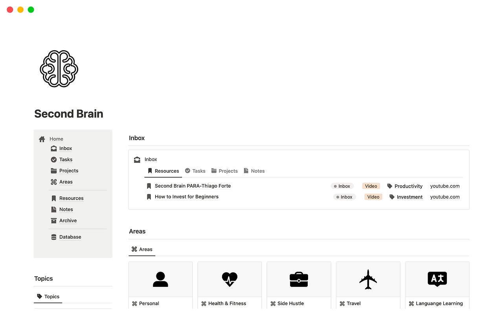

평소처럼 유튜브를 보던 중, 흥미로운 영상을 발견했다. 효과적으로 자료를 정리할 수 있는 [PARA 노트 정리법](https://fortelabs.com/blog/para/)과 관련한 내용이였다. 이 노트 정리법의 원리를 적용한 노션 템플릿도 무료로 제공해주었다.

나는 기존에 내가 만든 템플릿으로 태스크를 관리하고 있었는데, 내 것보다 좋다고 느꼈고, 곧바로 적용해 사용해보았다. 정말 강력한 툴을 손에 넣은 느낌이었다. 홀린듯이 이어서 다른 영상도 찾아보게되었고, 태스크 관리 기능이 강화된 노션 템플릿을 10만원 정도에 팔고 있음을 발견할 수 있었다. 노션 템플릿이 무려 10만원이나 하다니… 그런데 만약 이것이 내 인생의 생산성을 획기적으로 높여준다면, 이는 합리적인 투자아닐까? 나는 구매하고 싶은 충동이 들었다.

결제를 앞두고 혹시나 구글링을 해보았다. 더 저렴한 것이나 무료(해적판?)는 없을까? 노션 마켓플레이스도 살펴보았다.

결과적으로는 [비슷한 기능의 무료 템플릿](https://www.notion.so/marketplace/templates/second-brain-by-rosidssoy?cr=cre%3Arosidssoy)을 볼 수 있었다. 영상에 나온 유료 템플릿보다는 기능이 약간 부족해보이지만, 조금 커스텀한다면 흉내낼 수 있을 것 같았다.

여기서 나는 한가지 의문점이 들었다. 거의 똑같은 제품이지만, 어떤 사람은 나를 10만원을 (거의) 지불하게끔 했고, 어떤 사람은 무료로 제공했다. 그 둘의 차이는 무엇이었을까?

## 나를 혹하게 만든 8가지 영업 방법

### 권위

그는 영상에서 자신의 직업을 소개했다. 우리나라에서 가장 선망받는 직업이었다. 수능성적으로도 소득으로도 상위 0.1%해당 하는 엘리트였다. 그렇게 똑똑하시고, 열심히 사시는 사람인데, 이 제품을 구매하면 혹시 그 사람의 발끝이라도 따라갈 수 있지 않을까?라는 생각이 나를 구매로 이끌었다.

### 전문성

그의 영상과 블로그를 훑어본 결과 그는 최소 2~3년의 기간동안 생산성이라는 주제에 몰입하며 해당 분야에 전문성 기른것 같았다. Para Method부터 Second Brain, GTD 등의 키워드들과 관련 도서, 해외 트렌드를 섭렵하고 있어다. 노션과 옵시디언과 같은 도구 사용도 능숙해보였다. 처음에는 권위에서 신뢰를 얻었지만, 보다보니 이런 전문성이 신뢰를 더했다.

### 알고리즘 노출

나는 유튜브 추천영상에서 우연히 이를 접하게 되었다. 나는 한번도 이러한 키워드에 관심을 가져본적도 검색을 해본적도 없다. 아마 이 영상이 내게 추천된 이유는 내 관심사(개발)와 해당 영상의 인기도를 고려한 결과일 것이다. 해당 영상이 무의식적으로 다음 영상을 찾는 내 눈에 들어왔고, 이는 구매기회로 이어졌다. 그는 인스타그램같은 다른 SNS 채널도 적극적으로 이용하고 있었다.

### 무료 체험

나는 처음부터 지갑을 열 생각을 하지 않았다. 무료로 제공한 템플릿을 우선 사용해보고 만족을 느껴서 유료 버젼 결제를 고민하게 되었다.

### 프라이빗 딜

그는 유료 노션 템플릿 구매를 독립된 페이지로 유도했다. 찾아보니 그의 템플릿은 같은 가격에 노션 마켓플레이스에도 등록되어 있었다. 왜 그는 노션 마켓플레이스가 아니라 독립된 페이지로 유도했을까? 나는 그것이 다른 비슷한 상품들(더 저렴하거나 무료인)과의 가격비교를 차단하기 위함으로 판단한다.

### 한정판 마케팅

독립된 페이지에서는, 일정 기한 후에는 가격이 오를 것이라고 안내하고 있었다. 나는 가격이 오르기전에 어서 구매를 결정해야겠다 느꼈다.

### 과감하고 유동적인 가격 설정

10만원은 결코 적은 돈은 아니다. 어떤 사람은 노션 템플릿에 한푼도 쓰지 않겠지만, 만원정도는 대부분의 사람이 쓸 수 있을 것이라고 생각한다. 내 생각에 심리적 마지노선은 10만원인 것 같다. 그런데 그는 과감하게 그의 제품을 최상단으로 가격설정했다. 이는 자신의 제품이 자신이 없다면 불가능한 일일 것이다.  
위에서 일정한 기한 이후에는 가격이 오를 것이라고 말했다. 그렇다면 가격은 정말 계속해서 오르기만 할까? 이는 복제하는데 비용이 0인 디지털 상품의 성격과 매우 반대되어 보인다. 스팀게임은 출시 이후 가격이 계속 낮아지기 마련이다. 아마 그는 가격을 올리다가 판매량이 낮아지면 세일 등을 통해 가격을 낮추는 전략을 취할 가능성이 있다. 만약 그렇다면 수익을 극대화할 수 있을 것이다.

### 현지화

노션 마켓플레이스에서 영어로 된 무료 템플릿은 많았다. 이러한 템플릿은 보자마자 바로 사용하기는 어렵고 한번 설명을 들어야 하는데, 대부분 설명 영상은 영어였다.

## 교훈

우연히 접한 영상 하나가 내게 두가지 교훈을 주었다. 하나는 노션템플릿을 활용한 정보 수집과 태스크관리이고 다른 하나는 영업의 비법인 것 같다.

결과적으로 나는 노션 마켓플레이스에서 발견한 무료 템플릿을 약 6개월 정도 사용정도 사용했다. 이를 사용하면서 느낀점은 다음과 같다. **어떤 템플릿을 쓰냐보다도 꾸준히 쓰냐가 중요하다.** 또한, **완벽한 템플릿은 없는 것 같다. 필요에 맞게 맞춰가는 것이 중요하다**고 느낄 수 있었다.

**뭔가를 구매하기 전에는 우선 없이 살아보고 필요한 경우에 구매**한다면 절약할 수 있는 것 같다.(항상 가능하지는 않다.)

1년 후 후기를 더해보자면, 결국 나는 내 기존 템플릿으로 돌아왔다. 충동구매하지 않은 나를 칭찬한다.
