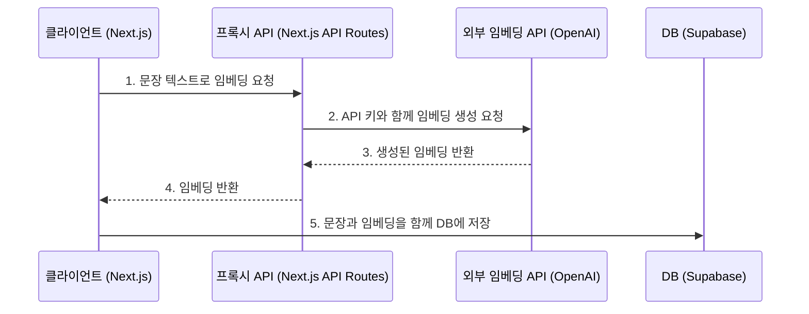
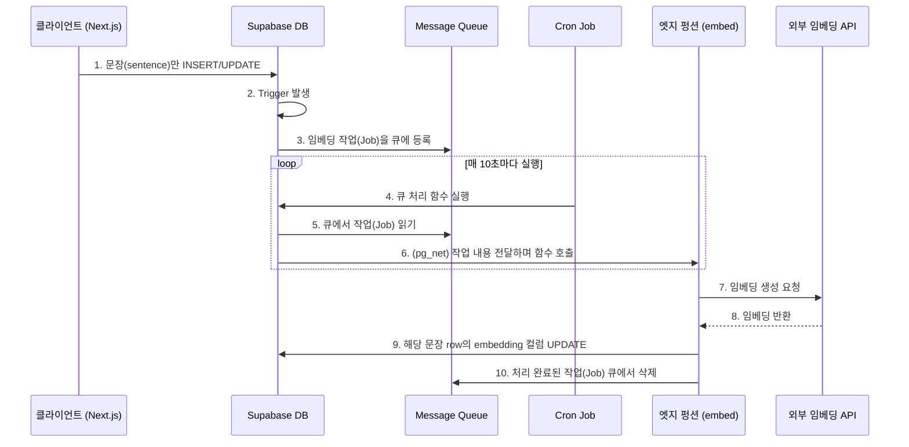

## 임베딩으로 추천 서비스 만들기

사용자가 인상 깊은 문장을 수집하면, 비슷한 문장을 수집한 다른 사용자와 연결해주는 서비스 글모이를 개발하면서 문장간 유사도 비교를 위해서 문장을 벡터로 변환하는 '임베딩(Embedding)' 기술을 사용하여, 생성된 임베딩 벡터를 데이터베이스에 저장할 필요가 있었다.

**임베딩**(Embedding)이란 단어나 문장 같은 텍스트 데이터를 컴퓨터가 처리하고 이해할 수 있는 숫자 형태, 즉 **벡터**(Vector)로 변환하는 기술이다. 이 벡터는 고차원 공간(수많은 차원을 가진 가상의 공간)에 표현되는데, 이때 의미적으로 유사한 단어나 문장은 이 공간에서 서로 가까운 위치에 배치된다.

예를 들어, "사과"와 "배"는 과일이라는 공통점 때문에 벡터 공간에서 가깝게 위치하고, "자동차"와 "비행기"는 운송 수단이라는 점에서 가까이 위치하지만, "사과"와 "자동차"는 멀리 떨어져 위치한다. 이렇게 벡터로 변환된 데이터는 단순히 텍스트를 비교하는 것보다 훨씬 정교하게 유사도를 측정하거나 패턴을 분석하는 데 활용될 수 있다.

프론트엔드에 Next.js, 백엔드와 데이터베이스로 Supabase를 사용했고, `sentences` 테이블 구조는 다음과 같다.

```sql
CREATE TABLE public.sentences (
    id bigint NOT NULL,
    created_at timestamp with time zone DEFAULT now() NOT NULL,
    book_id bigint,
    sentence text NOT NULL,
    page integer,
    tags text[],
    user_id uuid,
    embedding vector(1536) -- pgvector extension
);
```

문장이 생성되거나 수정될 때마다 해당 문장의 임베딩을 생성하고 `embedding` 컬럼에 저장하는 과정이 필요했습니다. 이 과정을 구현하기 위해 여러 아키텍처를 고민하고 시도했습니다.

## 세 가지 아키텍쳐 선택지

1.  **클라이언트단에서 처리하기** : 프론트엔드(Next.js)에서 문장 생성 API를 호출하기 전, 별도의 임베딩 생성 API를 호출하여 임베딩 값을 받아온 뒤, 문장 내용과 임베딩 값을 함께 백엔드로 전송하는 방식.
2.  **백엔드 단에서 처리하기** : 클라이언트가 문장 내용만 백엔드로 보내면, 백엔드 애플리케이션 서버가 직접 임베딩 서비스 API를 호출하여 임베딩을 생성하고 데이터베이스에 저장하는 방식.
3.  **데이터베이스 단에서 처리하**기 : 데이터베이스의 트리거(Trigger)와 엣지 펑션(Edge Function)을 활용하는 방식입니다. 문장이 데이터베이스에 추가되거나 변경되면, 트리거가 이를 감지하여 미리 정의된 엣지 펑션을 호출하고, 이 펑션이 비동기적으로 임베딩을 생성 및 저장하는 방식.

2번은 1번과 애플리케이션 레벨에서 처리한다는 점에서 본질적으로 유사하여, 가장 구현이 간단한 1번 방식을 먼저 시도했다.

### 클라이언트 단에서 처리하기

임베딩을 생성하기 위해서는 LLM이 필요하다. 선택지는 두 가지였다. (1) 로컬 LLM을 사용하는 방법과 (2) 외부 서비스를 이용하는 방법.

Gemma 같은 소형 오픈소스 LLM을 사용하더라도, 모델의 용량과 실행에 필요한 메모리(RAM) 부담으로 인해 배포 시 관리 포인트가 늘어난다. 반면 OpenAI 같은 외부 API는 사용한 만큼만 비용을 지불하며, `$0.02 / 1M tokens` 정도로 비용이 매우 저렴하고 레퍼런스도 풍부하다. 따라서 외부 API를 사용하기로 결정했다.

외부 API를 사용하려면 API 키를 요청 헤더에 포함해야 한다. **클라이언트에서 직접 API를 호출하면 이 API 키가 외부에 노출되는 심각한 보안 문제가 발생하므로 프록시 패턴을 적용해야한다.**



프록시 API는 클라이언트의 요청을 받아 자신의 서버 환경 변수에 저장된 API 키를 헤더에 추가하여 외부 API로 요청을 전달한다. 이를 통해 API 키 노출을 막을 수 있다. 추가로 인증 미들웨어를 구현하여 로그인한 사용자만 이 프록시 API를 호출할 수 있도록 제한하고, 추후 필요시 사용량 제어(Rate Limit) 기능을 도입할 수도 있다.

#### 장점

- 구현이 비교적 간단하고 직관적입니다.

#### 단점

- 어플리케이션 코드의 복잡성이 증가합니다.

### 데이터베이스 단에서 처리하기

기존의 아기텍쳐도 훌륭하지만, 데이터베이스의 내장 기능을 적극적으로 활용하여 임베딩 생성 로직을 데이터베이스 단에서 처리하는 방식 또한 매력적으로 보였다. 따라서, Supabase 공식문서 [Automatic embeddings](https://supabase.com/docs/guides/ai/automatic-embeddings) 아티클을 참고하여 이를 학습하고 비교해볼 겸 리팩토링을 해봤다.

**핵심은 데이터베이스 이벤트를 기반으로 임베딩 생성을 비동기적으로 처리하는 것이다.**



#### 주요 구성요소

- **Triggers**: `sentences` 테이블에 `INSERT`나 `UPDATE`가 발생할 때 이를 감지합니다.
- **pgmq**: Postgres 기반의 메시지 큐입니다. 트리거는 임베딩이 필요하다는 정보를 '작업(Job)'으로 만들어 이 큐에 넣습니다. 이를 통해 요청이 실패하더라도 재시도할 수 있는 안정성을 확보합니다.
- **pg_net**: PostgreSQL에서 HTTP 요청을 비동기적으로 보낼 수 있도록 지원하는 확장 기능입니다. 데이터베이스 내부에서 외부 API(여기서는 엣지 펑션)를 호출할 수 있게 해줍니다.
- **pg_cron**: 주기적으로 특정 함수를 실행시키는 스케줄러입니다. 여기서는 1_0\_초마다 큐에 쌓인 작업들을 처리하는 함수를 실행시킵니다.
- **Edge Functions**: 임베딩 생성을 실제로 처리하는 비즈니스 로직입니다. `pg_net`을 통해 DB에서 직접 호출되며, OpenAI API로 임베딩을 요청하고 결과를 다시 DB에 업데이트합니다.

#### 1\. 필요 확장 기능 활성화

먼저 Supabase 프로젝트의 SQL Editor에서 필요한 Postgres 확장 기능들을 활성화한다. Database - DATABASE MANAGEMENT - Extensions에서도 확장 기능을 관리할 수 있다.

```sql
- 벡터 타입 및 연산 지원
create extension if not exists vector with schema extensions;
-- 메시지 큐
create extension if not exists pgmq;
-- 비동기 HTTP 요청
create extension if not exists pg_net with schema extensions;
-- 스케줄링
create extension if not exists pg_cron;
```

#### 2\. 임베딩 입력값 생성 함수 및 트리거 설정

어떤 텍스트를 임베딩할지 정의하는 함수와, 이 함수를 호출하여 작업을 큐에 넣는 트리거를 생성다. `util.queue_embeddings` 함수는 인자로 받은 `embedding_input` 함수를 실행하여 얻은 텍스트와, 임베딩을 저장할 컬럼명(`embedding`)을 `embedding_jobs` 큐에 메시지로 보낸다.

```sql
- sentences 테이블의 'sentence' 컬럼을 임베딩 입력값으로 사용
create or replace function embedding_input(rec public.sentences)
returns text
language plpgsql
immutable
as $$
begin return rec.sentence;
end;
$$;
-- INSERT 발생 시 트리거
create trigger embed_sentences_on_insert
  after insert
  on sentences
  for each row
  execute function util.queue_embeddings('embedding_input', 'embedding');

-- UPDATE 발생 시 트리거 (sentence 컬럼이 변경될 때만)
create trigger embed_setences_on_update
  after update of sentence
  on setences
  for each row
  execute function util.queue_embeddings('embedding_input', 'embedding');
```

#### 3\. 엣지 펑션 (Edge Function) 작성

큐에 들어온 작업을 처리할 엣지 펑션을 작성합니다. 엣지 펑션은 Supabase에서 제공하는 서버리스 함수로, 클라우드 전반에 분산 배포되어 사용자에게 가장 가까운 곳에서 실행될 수 있어 낮은 지연 시간과 높은 성능을 제공한다. 이는 Deno 런타임을 기반으로 하며, 전달받은 정보를 이용해 실제 임베딩을 생성하고 DB를 업데이트한다. `supabase functions new embed` 명령어로 기본 틀을 생성하고, 가이드의 코드를 기반으로 작성한다. 이 함수는 `pg_net`을 통해 DB로부터 호출되며, 전달받은 정보를 이용해 실제 임베딩을 생성하고 DB를 업데이트한다.

```ts
// Setup type definitions for built-in Supabase Runtime APIs
import 'jsr:@supabase/functions-js/edge-runtime.d.ts';
// We'll use the OpenAI API to generate embeddings
import OpenAI from 'jsr:@openai/openai';
import { z } from 'npm:zod';
// We'll make a direct Postgres connection to update the document
import postgres from 'https://deno.land/x/postgresjs@v3.4.5/mod.js';
// Initialize OpenAI client
const openai = new OpenAI({
  // We'll need to manually set the `OPENAI_API_KEY` environment variable
  apiKey: Deno.env.get('OPENAI_API_KEY'),
});
// Initialize Postgres client
const sql = postgres(
  // `SUPABASE_DB_URL` is a built-in environment variable
  Deno.env.get('SUPABASE_DB_URL')!,
);
const jobSchema = z.object({
  jobId: z.number(),
  id: z.number(),
  schema: z.string(),
  table: z.string(),
  contentFunction: z.string(),
  embeddingColumn: z.string(),
});
const failedJobSchema = jobSchema.extend({
  error: z.string(),
});
type Job = z.infer<typeof jobSchema>;
type FailedJob = z.infer<typeof failedJobSchema>;
type Row = {
  id: string;
  content: unknown;
};
const QUEUE_NAME = 'embedding_jobs';
// Listen for HTTP requests
Deno.serve(async (req) => {
  if (req.method !== 'POST') {
    return new Response('expected POST request', { status: 405 });
  }
  if (req.headers.get('content-type') !== 'application/json') {
    return new Response('expected json body', { status: 400 });
  }
  // Use Zod to parse and validate the request body
  const parseResult = z.array(jobSchema).safeParse(await req.json());
  if (parseResult.error) {
    return new Response(`invalid request body: ${parseResult.error.message}`, {
      status: 400,
    });
  }
  const pendingJobs = parseResult.data;
  // Track jobs that completed successfully
  const completedJobs: Job[] = [];
  // Track jobs that failed due to an error
  const failedJobs: FailedJob[] = [];
  async function processJobs() {
    let currentJob: Job | undefined;
    while ((currentJob = pendingJobs.shift()) !== undefined) {
      try {
        await processJob(currentJob);
        completedJobs.push(currentJob);
      } catch (error) {
        failedJobs.push({
          ...currentJob,
          error: error instanceof Error ? error.message : JSON.stringify(error),
        });
      }
    }
  }
  try {
    // Process jobs while listening for worker termination
    await Promise.race([processJobs(), catchUnload()]);
  } catch (error) {
    // If the worker is terminating (e.g. wall clock limit reached),
    // add pending jobs to fail list with termination reason
    failedJobs.push(
      ...pendingJobs.map((job) => ({
        ...job,
        error: error instanceof Error ? error.message : JSON.stringify(error),
      })),
    );
  }
  // Log completed and failed jobs for traceability
  console.log('finished processing jobs:', {
    completedJobs: completedJobs.length,
    failedJobs: failedJobs.length,
  });
  return new Response(
    JSON.stringify({
      completedJobs,
      failedJobs,
    }),
    {
      // 200 OK response
      status: 200,
      // Custom headers to report job status
      headers: {
        'content-type': 'application/json',
        'x-completed-jobs': completedJobs.length.toString(),
        'x-failed-jobs': failedJobs.length.toString(),
      },
    },
  );
});
/**
 * Generates an embedding for the given text.
 */
async function generateEmbedding(text: string) {
  const response = await openai.embeddings.create({
    model: 'text-embedding-3-small',
    input: text,
  });
  const [data] = response.data;
  if (!data) {
    throw new Error('failed to generate embedding');
  }
  return data.embedding;
}
/**
 * Processes an embedding job.
 */
async function processJob(job: Job) {
  const { jobId, id, schema, table, contentFunction, embeddingColumn } = job;
  // Fetch content for the schema/table/row combination
  const [row]: [Row] = await sql`
    select
      id,
      ${sql(contentFunction)}(t) as content
    from
      ${sql(schema)}.${sql(table)} t
    where
      id = ${id}
  `;
  if (!row) {
    throw new Error(`row not found: ${schema}.${table}/${id}`);
  }
  if (typeof row.content !== 'string') {
    throw new Error(
      `invalid content - expected string: ${schema}.${table}/${id}`,
    );
  }
  const embedding = await generateEmbedding(row.content);
  await sql`
    update
      ${sql(schema)}.${sql(table)}
    set
      ${sql(embeddingColumn)} = ${JSON.stringify(embedding)}
    where
      id = ${id}
  `;
  await sql`
    select pgmq.delete(${QUEUE_NAME}, ${jobId}::bigint)
  `;
}
/**
 * Returns a promise that rejects if the worker is terminating.
 */
function catchUnload() {
  return new Promise((reject) => {
    addEventListener('beforeunload', (ev: any) => {
      reject(new Error(ev.detail?.reason));
    });
  });
}
```

핵심 로직은 다음과 같다.

1.  HTTP POST 요청으로 작업 목록(jobs)을 받습니다.
2.  각 작업(job)에 명시된 테이블(`sentences`)과 ID를 이용해 실제 문장 내용을 DB에서 조회합니다.
3.  OpenAI API를 호출하여 문장의 임베딩을 생성합니다.
4.  생성된 임베딩으로 원래 `sentences` 테이블의 해당 row를 `UPDATE`합니다.
5.  성공적으로 처리된 작업은 `pgmq` 큐에서 삭제합니다.

이 과정에서 `supabase secrets set OPENAI_API_KEY <your-api-key>` 명령어로 OpenAI API 키는 엣지 펑션의 환경 변수로 안전하게 설정합한다. `supabase functions deploy embed --no-verify-jwt`  
로 배포한다.

1.  **인덱스 생성**

효율적인 유사도 검색을 위해 `embedding` 컬럼에 인덱스를 추가한다. `hnsw` 인덱스는 대규모 벡터 검색에 최적화된 방식이다.

```sql
create index on sentences using hnsw (embedding halfvec_cosine_ops);
```

#### 장점

- 어플리케이션 코드의 복잡성이 감소합니다.

#### 단점

- 엣지 펑션, 데이터베이스 함수 등의 개념을 학습해야 합니다.
- 임베딩이 비동기적으로 추가되므로, 일관성이 보장되지 않을 수 있습니다.

## 회고

이번 프로젝트를 진행하면서 다양한 아키텍처를 고민하고 실제 구현해볼 수 있었던 점이 가장 좋았다. 각 방식에 모두 장점이 있으며, 서비스와 규모와 특성에 따라서 최적의 아키텍처가 달라질 수 있는 만큼, 각 방식을 동작 방식을 이해할 수 있었던게 좋은 경험이었던 것 같다. 어떤 방식이 확장성이 더 좋은 방법인가 고민해보는 것도 좋은 과제인 것 같다.
