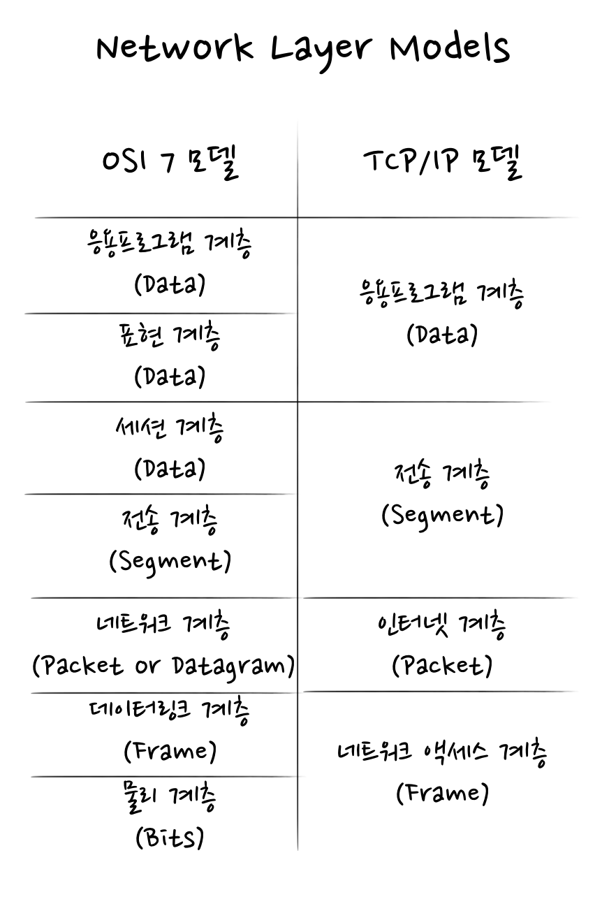
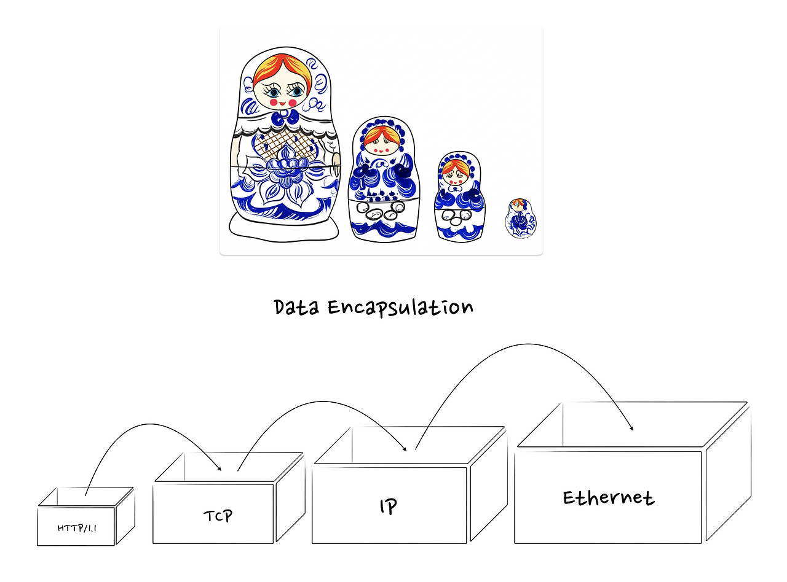
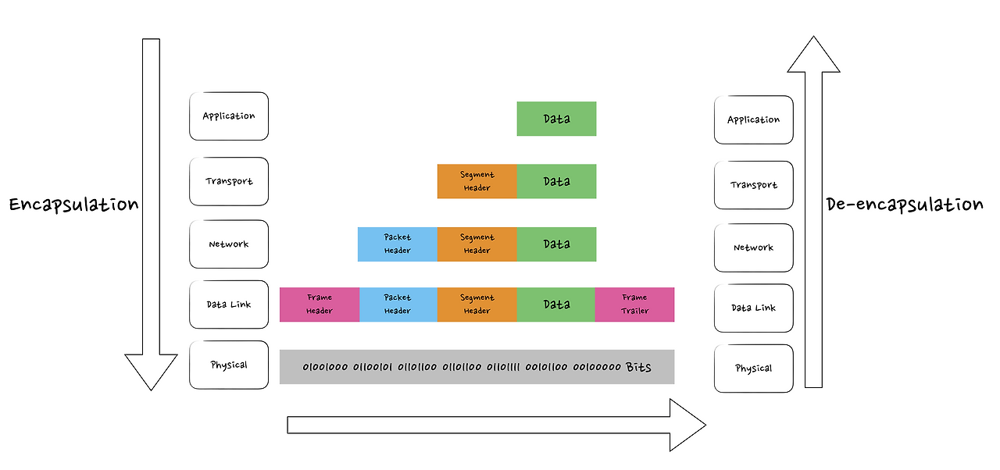
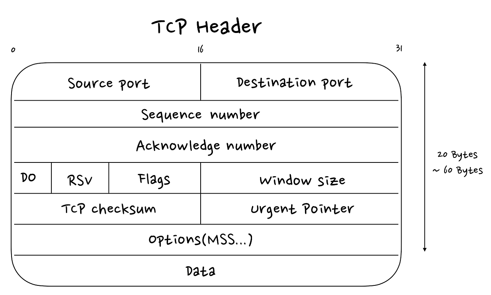
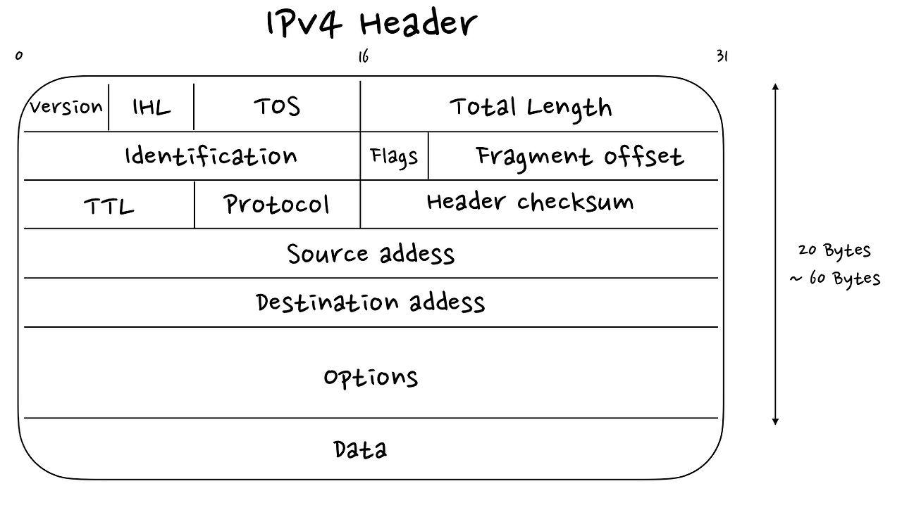
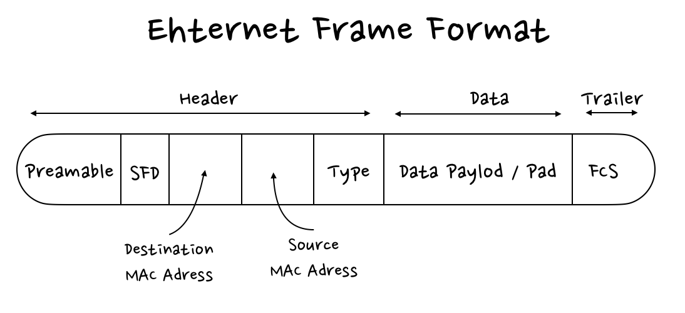

스택오버플로우에서 TCP의 전송 크기 한계에 관한 흥미로운 질답을 발견해서 이를 정리하고 공유해본다.

## 질문

TCP 연결에서 ‘패킷’의 최대 크기는 얼마인가요?  
by [informatik01](https://stackoverflow.com/users/814702/informatik01)

## 답변 1

애플리케이션 계층에서, 애플리케이션은 TCP를 스트림 지향 프로토콜로 사용합니다. 그리고 TCP는 ‘세그먼트(segment)’를 가지고 있으며, 신뢰할 수 없는 IP 패킷을 다루는 세부 사항을 추상화합니다(숨겨줍니다).  
TCP는 ‘패킷’ 대신 ‘세그먼트’를 다룹니다. 각 TCP 세그먼트는 TCP 헤더 안에 포함된 시퀀스 번호(sequence number)를 가집니다. TCP 세그먼트로 전송되는 실제 데이터의 크기는 가변적입니다.

일부 OS에서 지원하는 `getsockopt`의 `TCP_MAXSEG` 라는 값을 사용하여 최대 TCP 세그먼트 크기(MSS)를 가져올 수 있습니다. 하지만 모든 OS에서 지원되는 것은 아닙니다.

by [Brian R. Bondy](https://stackoverflow.com/users/3153/brian-r-bondy)

## 답변 2

이것은 아주 훌륭한 질문이고, 실제로 저도 업무에서 이 문제를 많이 겪습니다. 65k나 1500과 같은 '기술적으로는 맞는' 답변들이 많습니다. 저는 네트워크 인터페이스를 많이 작성해왔는데, 65k를 사용하는 것은 어리석은 짓이며, 1500 역시 큰 문제를 일으킬 수 있습니다. 제 작업물은 다양한 하드웨어, 플랫폼, 라우터 환경에서 실행되는데, 솔직히 제가 시작하는 지점은 1400바이트입니다. 만약 1400바이트보다 더 큰 크기가 필요하다면, 조금씩 크기를 늘려볼 수 있습니다. 아마 1450, 때로는 1480 정도까지는 가능할 겁니다. 그보다 더 필요하다면 당연히 패킷을 2개로 나눠야 하며, 여기에는 몇 가지 명백한 방법들이 있습니다.  
문제는 데이터 패킷을 생성하고 TCP를 통해 전송할 때, 헤더 데이터 같은 것들이 덧붙는다는 점입니다. 이런 '부가적인 짐(baggage)' 때문에 패킷 크기가 1500을 넘어서게 될 수 있습니다. 또한 많은 하드웨어가 더 낮은 제한을 가지고 있습니다.  
만약 한계까지 '밀어붙인다면' 정말 이상한 일들이 발생할 수 있습니다. 데이터가 잘리는(truncated) 것은 명백하고, 드물게는 데이터가 유실(dropped)되는 것도 봤습니다. 데이터가 손상(corrupted)되는 경우도 드물지만 분명히 일어납니다.  
by [Nektarios](https://stackoverflow.com/users/361312/nektarios)

## 답변 3

TCP 패킷 크기의 절대적인 한계는 64KB(65535바이트)입니다. 하지만 현실적으로 이는 여러분이 보게 될 그 어떤 패킷의 크기보다 훨씬 큽니다. 왜냐하면 하위 계층(예: 이더넷)이 더 작은 패킷 크기를 갖기 때문입니다.  
예를 들어, 이더넷의 MTU(최대 전송 단위)는 1500바이트입니다. 토큰링(Token Ring)과 같은 일부 네트워크 유형은 더 큰 MTU를 가지며, 일부는 더 작은 MTU를 갖지만, 그 값은 각 물리 기술마다 고정되어 있습니다.  
by [Ether](https://stackoverflow.com/users/40468/ether)

## 네트워크 계층

네트워크 통신 과정은 매우 복잡하다. 수 많은 장비와 프로토콜이 상호작용하며 통신이 이루어진다. 이를 쉽게 이해하고 관리하기 위해서 통신 과정을 계층화하여 네트워크 계층 모델을 사용한다. 네트워크 계층 모델에서 각 계층은 특정 역할만 수행하며, 바로 위아래 계층과만 상호작용한다. 이러한 추상화는 문제를 파악하고 해결하기 쉽게한다.  
대표적인 네트워크 계층 모델로는 TCP/IP 모델과 OSI 7계층 모델이 있다. 번역에 따라 계층 이름이 다를 수 있음을 유의해야한다.  
TCP/IP 모델 : 1970년대 미국방부에서 개발한 모델. 통신 과정을 4개 계층으로 구분.  
OSI 7 모델: 국제표준화기구(ISO)가 제정한 개념 모델로, 통신 과정을 7개 계층으로 구분.

## 헤더와 캡슐화

웹 브라우저같은 애플리케이션에서 데이터를 보내면, 데이터는 각 계층을 내려가면서 마치 러시아 인형 마트료시카처럼 포장된다. 각 계층은 자신의 역할에 필요한 제어 정보(주소, 순서, 오류 검증 등)를 데이터 앞부분에 추가하는데, 이를 **헤더**(Header)라고 한다. 이렇게 데이터가 하위 계층으로 넘겨지며 헤더가 붙여지는 과정을 **캡슐화**(Encapsulation)라고 한다.

- **4계층 (전송 계층):** 데이터에 **TCP 헤더**를 붙여 **세그먼트**(Segment)가 됩니다.
- **3계층 (네트워크 계층):** 세그먼트에 **IP 헤더**를 붙여 **패킷**(Packet)이 됩니다.
- **2계층 (데이터 링크 계층):** 패킷에 **이더넷 헤더와 트레일러**를 붙여 **프레임**(Frame)이 됩니다.

수신 측에서는 이 과정을 거꾸로 수행하며 포장(헤더)을 읽고 처리하여 원본 데이터를 얻는데, 이를 **역캡슐화**(De-encapsulation)라고 한다.각 계층에서는 해당 계층의 헤더(포장지)만을 가지고 주어진 역할만을 처리한다. 계층마다 명확한 역할 분담을 통해 자신이 잘하는 일에 집중하고, 다른 역할은 다른 계층의 프로토콜에 위임하는 것이다.

## TCP 프로토콜

전송계층(4계층)의 프로토콜. TCP(Transmission Control Protocol)는 먼저 연결을 수립한 다음 데이터를 전송하는 연결형 프로토콜이다. 데이터 전송 전후로 송수신 측이 `3-way/4-way-handshake`로 전송시작(종료)준비가 되었는지 확인하여 신뢰성 있는 연결을 보장한다. 데이터 전송과정에서는 각 세그먼트에 시퀀스 번호를 부여하고 이를 순차적으로 처리하여, 순서와 유실여부를 확인한다. 데이터가 유실 된 경우 재전송을 요청하여 데이터의 무결성을 보장한다. TCP는 양 끝단(End-to-end)의 신뢰성만 신경 쓸 뿐, 데이터가 목적지까지 가는 '경로'를 찾고 데이터를 얼마 크기로 어떻게 나눌지 역할은 하위 계층인 IP에 위임한다.

## IP 프로토콜

네트워크계층(3계층)의 프로토콜. IP(Internet Protocol)은 여러 네트워크를 건너 최종 목적지까지 데이터(패킷)를 최종 목적지(컴퓨터)까지 전달을 책임진다. 데이터 패킷에 출발지 및 목적지의 논리적 주소(IP 주소)를 부여하는 주소 지정(Addressing)과 여러 네트워크를 거쳐 목적지까지 갈 수 있는 최적의 경로를 찾아 데이터를 전달하는 경로 설정(Routing)을 담당한다. IP는 데이터를 보내기 위해 최선을 다할 뿐, 데이터의 도착 순서나 전송 자체를 보장하지 않는다. 이 부족한 신뢰성은 상위 계층인 TCP가 보완한다. 또한, IP는 라우터가 다음 네트워크로 패킷을 전달하려 할 때, 다음 네트워크의 MTU(Maximum Transmission Unit, 최대 전송 단위)를 확인하고 패킷의 크기가 해당 네트워크의 MTU보다 크면 IP 계층에서 패킷을 여러 개의 작은 조각으로 나누는 IP 단편화 (Fragmentation)역할을 수행한다. 각 조각은 독립적인 IP 패킷이 되어 전송되고, 최종 목적지 호스트의 IP 계층에서 다시 조립된다. 실제 네트워크 장비(랜카드, 스위치 등)를 통해 데이터를 전기 신호나 빛으로 바꿔 보내는 물리적 전송의 역할은 이더넷 프로토콜(2계층)에 위임한다.

## 이더넷

데이터링크(2계층)의 프로토콜. 이더넷(Ethernet)은 같은 로컬 네트워크(LAN) 내에서 프레임(Frame) 단위로 변환하여 전송한다. 물리적 주소(MAC 주소)를 사용하여 같은 네트워크에 있는 장비를 식별하여 해당 '장비' 간의 통신을 담당한다. 이더넷은 한 번에 보낼 수 있는 데이터의 최대 크기를 제한하는데, 이를 MTU(Maximum Transmission Unit, 최대 전송 단위)라고 한다. 표준 이더넷의 MTU는 1500바이트이다. 이는 이더넷 프레임 하나에 담을 수 있는 IP 패킷의 최대 크기가 1500바이트임을을 의미한다. 이더넷은 로컬 네트워크 너머의 경로를 알지 못하며, 라우터를 통해 다른 네트워크로 데이터를 보내는 역할은 상위 계층인 IP 프로토콜에 의존한다.

## TCP 세그먼트의 최대 크기

이제 TCP 세그먼트의 최대 크기에 대한 질문에 답을 할 수 있는 모든 정보가 모였다.

1.  이론적 한계(64KB) : IP 헤더의 '총 길이(Total Length)' 필드는 16비트이므로, IP 패킷의 최대 크기는 2  
    ^16−1=65,535바이트(약 64KB)이다. 따라서 로컬호스트 통신처럼 이더넷을 거치지 않는 환경(내 컴퓨터내에서 통신)에서는 이 크기가 유효하다.
2.  현실적 한계 (1460B): 하지만 대부분의 인터넷 통신은 MTU가 1500바이트인 이더넷 구간을 지난다. TCP 세그먼트가 IP 헤더(20B)와 TCP 헤더(20B)와 함께 캡슐화된 IP 패킷의 크기가 1500바이트를 넘으면, 위에서 설명한 비효율적인 IP 단편화가 발생한다. 따라서 통신 시작 단계(`3-way-handshake`)에서 양측은 단편화를 피하기 위해 MTU를 기반으로 한 번에 보낼 수 있는 순수 데이터의 최대 크기, 즉 MSS(Maximum Segment Size)를 서로 교환한다. 결론적으로, IP 단편화를 피하고 효율적으로 통신하기 위해 TCP 세그먼트의 일반적인 최대 크기는 1460바이트로 여겨진다.

> MSS = 이더넷 MTU - IP 헤더 크기 - TCP 헤더 크기  
> 1460 bytes = 1500 bytes − 20 bytes − 20 bytes

## 정리

‘TCP 세그먼트의 최대 크기’라는 간단해 보이는 질문은 사실 네트워크 계층 모델과, 각 계층에서 여러 프로토콜들이 어떻게 상호작용하는지에 대한 이해를 필요로 한다. 개발자는 TCP를 사용하여 스트림(Stream)처럼 편하게 데이터를 보내지만, 그 밑에서는 TCP, IP, 이더넷 프로토콜이 각자의 역할을 수행하며 데이터를 쪼개고, 주소를 붙이고, 경로를 찾는 복잡한 과정을 거친다.  
이처럼, 네트워크는 역할과 책임이 명확히 나뉜 계층들의 협력으로 이루어지므로, 내가 보내는 데이터가 어떤 계층을 거치며 어떻게 처리되는지 이해한다면, 네트워크 관련 문제를 해결하고 더 효율적인 프로그램을 작성하는 데 큰 도움이 될 수 있을 것 같아, 해당 질문에 관한 내용을 학습하고 정리하여 공유해본다.

## 참고자료

[스택오버플로우 : Maximum packet size for a TCP connection](https://stackoverflow.com/questions/2613734/maximum-packet-size-for-a-tcp-connection)  
[위키백과 : OSI model](https://en.wikipedia.org/wiki/OSI_model)  
[JapPMedia : TCP Handshake, SYN, SYN / ACK, ACK, MSS & MTU - Computer Networks For Developers 08](https://www.youtube.com/watch?v=_ui3kOQInk0)  
[위키백과 : Internet protocol suite](https://en.wikipedia.org/wiki/Internet_protocol_suite)  
[클라우드플레어 : 네트워크 계층이란 무엇인가요?](https://www.cloudflare.com/ko-kr/learning/network-layer/what-is-the-network-layer/)  
[Computer Networking Notes : Data Encapsulation and De-encapsulation Explained](https://www.computernetworkingnotes.com/ccna-study-guide/data-encapsulation-and-de-encapsulation-explained.html)  
[클라우드플레어 : MSS(최대 세그먼트 크기)란?](https://www.cloudflare.com/ko-kr/learning/network-layer/what-is-mss/)
