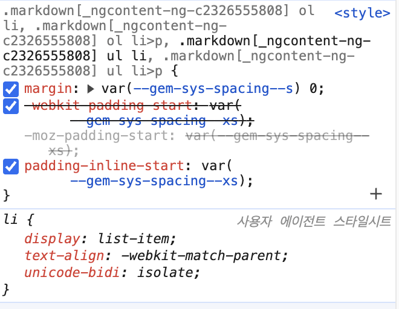

## 크로스 브라우징 이슈

웹 개발을하다 보면 Chrome, Firefox, Safari, Edge 등 브라우저마다 화면이 다르게 보이는 경험을 하게된다.이를 **크로스 브라우징 이슈**라고 하며, 이는 웹 개발자가 일관된 사용자 경험을 제공하는 데 큰 장애물이 된다.

## 사용자 에이전트 스타일시트 (User Agent Stylesheet)

이 문제의 원인은 각 웹 브라우저가 가진 고유한 기본 스타일, 즉 **사용자 에이전트 스타일시트** 때문이다. 예를 들어, `<p>` 태그는 브라우저마다 다른 기본 상하 여백(margin)을 가질 수 있고, `<h1>` 태그의 글자 크기나 굵기, 버튼(`<button>`)의 기본 모양 등도 제 각각이다.

브라우저의 개발자 도구(F12 또는 마우스 우클릭 > 검사)를 열어 특정 요소에 적용된 스타일의 출처를 확인 할 수 있다. `*사용자 에이전트 스타일시트`\*



## 3가지 스타일시트와 적용 순서

스타일시트의 종류에는, 앞서 말한 사용자 에이전트 스타일시트, 작성자 스타일시트, 사용자 스타일시트가 있다.

- **사용자 에이전트 스타일시트 (User Agent Stylesheet):** 브라우저 자체의 기본 스타일 (가장 낮은 우선순위).
- **작성자 스타일시트 (Author Stylesheet):** 개발자가 작성한 CSS 파일 (`<link>`, `<style>`, 인라인 스타일 등).
- **사용자 스타일시트 (User Stylesheet):** 사용자가 브라우저 설정 등을 통해 직접 지정한 스타일 (일반적으로 작성자 스타일시트보다 우선순위가 낮지만, 사용자가 `!important`를 사용하면 작성자의 `!important`보다 우선될 수 있음 - 접근성 기능 등에서 활용)

사용자 에이전트 스타일 시트로 인한 브라우저별 스타일 차이를 해결하기 위해서는, 작성자 스타일시트로 이를 덮어 씌우면 된다.

## Reset CSS vs Normalize.css

선배 개발자들은 이미 이에 관한 문제를 해결하기 위한 코드를 작성해왔다.

### Reset CSS

브라우저가 제공하는 모든 기본 스타일을 거의 '0'으로 만들어 버린다. 모든 요소의 마진, 패딩, 글꼴 크기 등을 강제로 초기화하여 어떤 브라우저에서든 완전히 동일한 '백지' 상태에서 스타일링을 시작할 수 있게 한다. ([Eric Meyer's Reset CSS](https://meyerweb.com/eric/tools/css/reset/)가 대표적입니다.)

- **장점:** : 예측 가능성이 높음.
- **단점:** : 유용할 수 있는 기본 스타일까지 모두 제거하므로, 거의 모든 요소의 스타일을 처음부터 다시 정의해야 함.

### Normalize.css

Reset CSS와 달리, 유용한 기본 스타일은 유지하면서 브라우저 간의 스타일 차이만을 수정하는 데 초점을 맞춘다. 예를 들어, 모든 브라우저에서 `<button>` 요소가 동일한 `font-family`를 갖도록 하거나, `<h1>` 태그의 `margin` 값을 일관되게 조정하는 식입니다. 즉, 스타일을 완전히 없애는 것이 아니라, '정규화(Normalize)'하여 일관성을 부여한다.

- **장점:** : 유용한 기본값을 유지하고, 브라우저 간 차이점만 수정하므로 작업량이 줄어듦. 버그 수정 및 문서화가 잘 되어 있음.
- **단점:** : 약간의 기본 스타일이 남아있으므로, 이를 원치 않으면 추가적인 초기화 필요.

적용방법([mordern-nomailize](https://github.com/sindresorhus/modern-normalize))

```css
@import 'node_modules/modern-normalize/modern-normalize.css';
```

```html
<link
  rel="stylesheet"
  href="node_modules/modern-normalize/modern-normalize.css"
/>
```

## tailwindcss의 Preflight

최근 CSS 프레임워크로 tailwindcss가 급부상하고 있다. 따라서 tailwindcss가 앞서 말한 크로스 브라우징 이슈를 어떻게 해결하고 있는지를 정리해보자 한다.

```css
//global.css
@import "tailwindcss";
```

tailwindcss를 프로젝트에 설치하고 CSS 파일에 `@import "tailwindcss";` 를 추가하면 자동으로 Preflight가 자동으로 `base` [레이어](https://developer.mozilla.org/ko/docs/Web/CSS/@layer)에 주입된다. Preflight는 tailwindcss는 자체적으로 제공하는 기본 스타일 세트다. (Preflight는 **`modern-normalize`**를 기반으로 구축되었다.)

## 정리

크로스 브라우징 이슈를 해결하기 위해서는 프로젝트를 처음 시작할 때 기호나 전략에 따라 스타일 초기화나 정규화를 잘 선택하는 것이 핵심이다.
