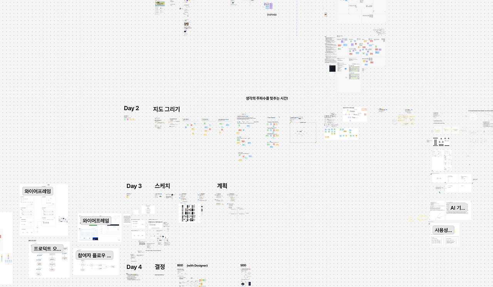
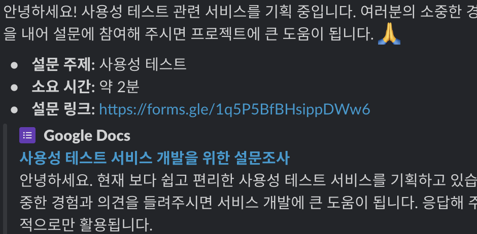
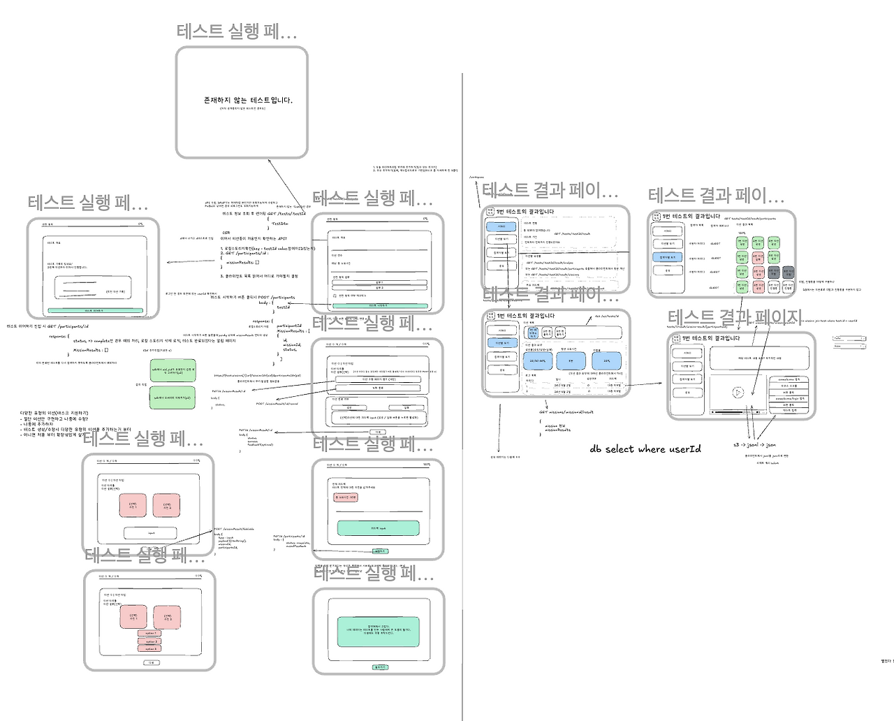
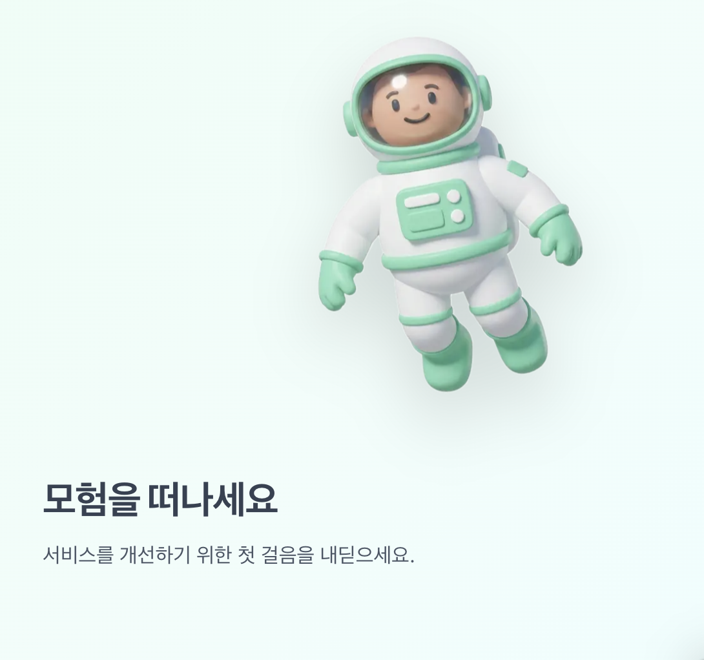
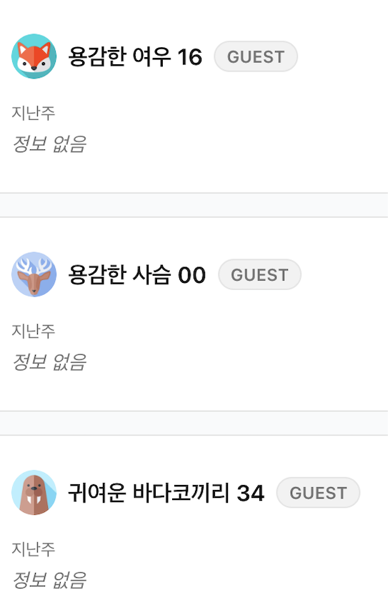
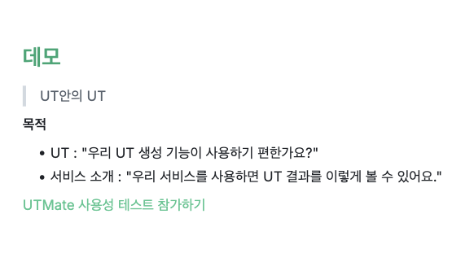

부스트캠프 웹·모바일 10기 그룹프로젝트를 진행하며 매주 회고를 남겨보았다. 지루하고 현학적인 기술 이야기보다 의사결정과정에 있어서 내가 어떤 생각을 했고 무엇을 느꼈는지를 중점으로 정리해 봤다.

## 1주차 회고 : 주제 선정과 기획

> 사용성 테스트 플랫폼 만들기.



### 아이디어 회의

새로운 사람들과 만남에 무척 긴장했었다. 그러나 곧 바보같은 걱정을 했다고 느꼈다. 부캠에는 다 잘하고 열심히 하는 사람밖에 없다는 걸 까먹었다.

평소에 나는 프로젝트 아이디어가 떠오르면 잘 쌓아놨던 것 같은데, 이번에 내가 낸 아이디어는 내가 봐도 좀 구렸다. 모두가 다 좋아해야 한다는 생각에 자체검열을 하다보니 무난하고 구린 것만 제안하게 된 것 같다.

그러다 보니 나는 내 기준 팀플 블랙리스트를 비토하는 데만 애썼던 것 같다. 좋은 쪽으로 에너지를 발산하지 못한 것이 아쉽다. 하지만 사실 좋은 아이디어라는 건 그냥 아이디어를 모은다고 얻어지는게 아닌 것 같기도 하다. 좋은 아이디어는 듣자마자(혹은 떠올리자마자) “이거다!”라고 알 수 있다.

```plaintext
내 기준 팀 프로젝트로 해서는 안되는 것
1. 커뮤니티 & SNS : 실제 사용자를 모으기 어렵다. 해결하고자 하는 문제가 명확하지 않다.
2. 게임 : 게임성이 모든 걸 좌우하게 된다. 그리고 게임성이라는 건 굉장히 미묘하다.
3. AI가 메인인 서비스 : 서비스의 품질을 보장할 수 없다. AI는 보조적인 수단으로 사용하거나 매우 잘 써야한다.
4. 협업툴 : 뻔하다.
(근데 이걸 빼고 나면 뭐가 남지...?)
```

그런데 이번 프로젝트에서는 정말 운이 좋게 사용성 테스트(UT) 솔루션이라는 좋은 주제를 만날 수 있었다. 듣자마다 “이거다!” 했다. 이 주제가 왜 좋은 프로젝트 주제인지를 간략하게 설명하면 다음과 같다

```plaintext
1. 있어빌리티한 주제 : 사용성이라는 있어보이는 주제. 나는 사용성 테스트가 뭔지 이때 처음 알았다..
2. 명확한 문제의식 : UT의 허들을 낮추자!
3. 적절한 레퍼런스 : 참고할만한 해외 서비스들이 있다. 없는 걸 만드는 건 난이도가 10배다.
4. 도전적인 기술적 난이도 : SDK 개발 + 로그 분석... 이런걸 언제 해보겠어!
5. 잠재력 : 분석기능을 고도화할 수도 있고 테스터 매칭 등의 기능으로 확장할 수 도 있다.
```

### 방향

1주차에는, 무엇을 개발할지 뿐만 아니라 어떻게 개발할 지도 이야기할 수 있었다. 그리고 다음과 같은 팀 목표를 설정할 수 있었다.

```plaintext
팀 목표
1. 사용자/서비스 관점에서 의사결정하기
2. 팀 차원에서 신중한 의사결정하기
3. 데이터에 근거해서 의사결정하기
```

그리고 여기에 나는 개인적인 목표를 하나 더했다. ‘서비스 개선을 위해서라면 뭐든지 해보기’. 이러한 목표에 근거해서, 기획서를 완성하기 이전에 간단한 설문조사로 데이터를 수집해보면 좋겠다고 생각했다. 곧바로 사용성 테스트 경험을 묻는 설문을 만들었다. ‘만들면 쓰실건가요?’같은 확실하지 않은 질문보다, 사용성 테스트와 관련한 경험 중심으로 객관적인 질문을 구성하려 노력했다. 현직자분들을 포함하여 약 40명 정도가 설문에 응답했고, 팀 기획 방향을 확실히 하는데 도움이 되는 유의미한 데이터를 얻을 수 있었다.



## 2주차 회고 : MVP 개발

> 다른 모든 것을 생략하고 기술적으로 난이도가 가장 어려운 부분에 집중했다. UT가 진행되는 동안 SDK로 로그를 수집될 수 있는지를 검증했다.

### 회의

팀원 모두가 내향적인 성격이여서, 회의를 주도하는 사람이 없었다. 회의중 긴 정적이 이어질 때도 종종 있었다. 회의가 매끄럽지 않다는 팀 피드백이 있었고, 이를 반영하여, 필요한 경우에만 회의를 갖고, 회의 전에는 이야기할 내용을 미리 준비하자는 액션을 도출했다.

이때 정해진 회의방식이 이후 팀 스타일로 굳어졌다. 데일리 스크럼을 매일 오전 10시부터 12시까지 했다. 데일리 스크럼에서는 전날 작업 내용을 공유하고 새로 제안할 것을 공유하고, 다음 작업을 할당했다. 추가적으로, 새 기능을 설계하고 태스크를 정의하는 월요일에는 오후에도 회의했고, 데모 전날인 목요일에는 배포를 진행하기 위해 오후 5시에 모였다.

### 위기

팀원 한분이 개인적인 이유(Positive)로 퇴소했다. 처음 아이디어를 제안했기도 하고, 리더십이 있는 분이여서 매우 아쉬웠다. 시니어 피드백에서는 서비스 볼륨이 너무 커 우선순위를 잘 정해야할 것 같다는 피드백을 받았다. 안그래도 인력이 줄어들었는데, 매우 불안했다.

하지만 이는 우리 팀이 각성하는 계기가 되었다. 빠른 개발이라는 공동의 목표를 갖게 되었으며, 기능별 개발 우선순위를 동기화할 수 있었다. 결과적으로 2주차 목표인 MVP 개발을 성공적으로 완료할 수 있었다.

## 3주차 회고 : 인증과 테스트 생성 기능

> 기능을 유저 플로우 순으로 구현하기로 했다. 따라서 3주차에는 회원가입하고 테스트를 생성하는 기능을 구현했다.

### 초능력

우리 팀은 프론트 2명, 백엔드 1명이었는데, 백엔드 한분이 혼자 한주만에 CI/CD, 인증 API, 테스트 CRUD API를 해냈다. 초능력을 쓴 것 같다고 생각했다. 적어도 2명 분량을 해냈다고 느꼈다. 물론 일부 코드는 이전 프로젝트에서 작업 것을 가져왔기 때문에 가능한 거기도 하지만, 모두 작업 퀄리티가 높아서 놀랐다. 항상 느끼는 거지만 ‘자바 스프링을 하다왔다’이거는 항상 신뢰가 가는 것 같다.

### 분업

빠른 개발을 위해 분업할 필요가 있었다. 풀스택과정이라는 취지에 어긋날 수 도 있다고 느꼈지만, 목표를 완수하려면 어쩔수 없었던것 같다. 나는 프론트 작업을 주로하게 되었다.

### API 명세

API 명세 설계에서 의견 불일치가 있기도 했다. 나는 조금 더 RESTful한 API 명세를 원했는데, 모듈간의 의존성 문제를 이유로 거절 당했다. 조금 더 문서로 정리해서 다시 공유할 수 도 있겠겠지만, 빠른 개발과 분업이 필요하다고 생각했기 때문에, 이런 부분에 시간을 쓰기보다는 내가 맡아서 해야할 일에 집중하기로 했다. 일단 돌아가는 뭔가를 만드는데 집중하기로 했다.

### 팀 스타일

작업을 진행하면서 내가 파악한 우리 팀의 스타일은 느긋하면서도 급하다는 것이다. A기능과 B기능이 있을 때 우리는 “둘 다 하죠”라고 이야기하면서도, 한 주의 작업은 욕심내지 않고 목요일 5시에 마무리했다. 매주 금요일의 팀 회고는 후딱 5분만에 끝마칠 때도 있지만, 모두 같은 방향으로 피드백과 액션을 도출했으며, 도출된 액션은 무조건 반영했다.

## 4주차 회고 : 테스트 참여

> 이어서, 테스트 참여 기능과 테스트 결과 기능을 작업했다. 결과 기능이 지연되어 다음 주로 밀렸다.



[##_Image|kage@bQhJ0u/dJMcacB2hK2/AAAAAAAAAAAAAAAAAAAAAHdpyMU7fPXzR11uUxPRAGIAwfbIa1MbhiIJV7j0Kbco/img.png?credential=yqXZFxpELC7KVnFOS48ylbz2pIh7yKj8&amp;expires=1777561199&amp;allow_ip=&amp;allow_referer=&amp;signature=VMM9jC90jT2%2BaAiG%2FtMhZ8qpshI%3D|CDM|1.3|{"originWidth":1356,"originHeight":1094,"style":"alignCenter"}_##]

### 회고

페이지 시안이나 구체적인 API 명세 없이 작업하는 것을 지양하자는 팀 피드백이 있었다. 지난주에는 구체적인 와이어프레임 없이 작업했다. 따라서, ‘다른 서비스 참고해서 알아서 센스있게 개발해주세요.’의 방식으로 개발이 진행되었다. API 명세도 구체적으로 정의되지 않아서, ‘일단 구현되면 거기에 맞출게요’와 같은 방식으로 개발했다. 빠른 개발이 가능하다는 장점이 있었지만 그 이외 모든 것이 단점이었다. 특히 작업의 퀄리티가 개인의 실력과 경험에 의해서 크게 결정되고, 팀 시너지를 얻을 수 없는 것이 가장 큰 문제였다.

따라서, 이번주에는 이러한 피드백을 반영하여 월요일 설계 시간에, 어떤 화면에서 어떤 API를 호출하고, 요청과 응답형식이 어떻게 되고, 예외 상황 등은 무엇이 있는지를 다 같이 그림으로 정리하여 모두 공유한다음 작업을 시작했다. 이렇게 정의한다고 설계시간이 크게 늘어나지도 않았고, 오히려 코드를 수정할 일이 적어져서 한주 작업이 더 원활하게 진행되었다. 여러 예외 상황에 대해서 더 많이 고민 해 볼 수 있는 것은 덤이었다. 매주 회고를 잘하는 것이 우리 팀의 장점이라고 느꼈다.

### 의사결정

테스트 참여중 이탈한 경우 테스트를 이어할 수 있는 기능과 테스트를 이탈하는 경우와 테스트를 진행 중인 경우를 구분하는 기능을 구현하느라 생각했던 것보다 테스트 참여 기능 개발이 지연되었다. 부가적인 기능은 나중에 구현해도 좋았을 것 같다는 아쉬움이 들어 이를 팀 회고 시간에 공유했다. 기능 우선 순위와 예상 작업시간을 복합적으로 고려해서 태스크를 분배하자는 액션을 도출했다.



### 에셋

항상, 진짜같은 웹사이트와 그렇지 않은 웹사이트를 구분하는 것은 에셋이라고 느꼈어서, 이번 프로젝트에서는 에셋을 많이 사용해서 실제 서비스와 유사하게 만들고 싶었다. 그리고 이런부분이 대AI시대에 AI를 적극 활용할 수 있는 부분이라고 느꼈다. 따라서, 서비스 소개에 사용할 캐릭터를 AI로 생성해보았다. 항상 만족스러운 응답이 나온것은 아니지만 그중 가장 맘에 드는 것을 선택해서 사용했다. 나름 만족스러운 결과물이 나온 것 같다.

심심할때마다 이미지 생성 요청을 한번씩 해보는 것도 좋은 것 같다. 내가 AI 생성 이미지를 공유한 뒤로, 팀원들도 AI를 활용해서 비슷한 이미지를 만들어 오기도 했다. 이 과정에서, 이미지 각도 조정, 배경색깔 변경 등은 내가 직접할 수 있도록 사용법을 익혀둘 필요를 느꼈다.

AI 생성 컨텐츠 이외에도 여러 무료 에셋들을 찾아보고, 그 중 마음에 드는 것을 우리 서비스에 적용하기도 했다. 랜딩페이지 등 다양한 부분에 더 많은 에셋을 써보지 못해 아쉽긴 하지만, 첫 시도여서 만족스럽다.



## 5주차 회고 : 테스트 결과

> 테스트 결과를 확인할 수 있는 기능을 작업했다. 기존 결과페이지 레이아웃이 밋밋하고 체계적이지 않은 것 같아서 새 레이아웃을 제안했고 이게 받아들여졌다.

### 마이그레이션

5주차 배포에서는 메인 디비를 날렸다. 마이그레이션 과정에서 문제가 생겨서 그냥 날리기로 결정했다. 백엔드 팀원이 친절하게 마이그레이션 가이드 문서도 작성해주고, 직접 시연(+ 강의)까지 해주었는데도 사실 나는 마이그레이션이 뭔지 아직도 이해를 못했다. 이해 못하는 개념이 있으면 꼭 따로 공부를 할 필요를 느꼈다.

### 개발 환경 구축

로컬에서 테스트하기 좋은 환경을 구축해야한다고 생각했다. 우리 서비스 개발에 페인포인트를 확인할 수 있었다. 우리 서비스의 기능을 로컬에서 테스트하려면, 클라이언트, 테스트 대상 사이트에 삽입할 스크립트, 테스트 대상 사이트, API 서버가 갖춰져야했다. 로컬 개발 환경에서는 이것들을 수동으로 작업해줘야하는 부분들이 많았고, 일일히 그렇게 하고 있었다. 그 과정이 매우 귀찮았기 때문에 나는 완벽히 동작을 테스트해보기 보다는 대충 이정도면 대충 돌아가겠지 하고 PR을 날린 적이 많다. 편리한 로컬 개발환경이 구축되지 않은 점이, 코드 퀄리티를 낮추며 자잘한 버그를 놓치는 원인이 된다고 생각했다. 개발 초기에 이런 점을 고려하지 못한 점이 아쉽다.

로컬에서 테스트하기 귀찮다 보니, 일단 배포해보고 프로덕션 환경에서 QA를 자주하게 된것 같다. API 모킹을 더 실제와 유사하게 구현하거나, 더미 데이터를 DB 벌크로 삽입하여 성능을 확인할 필요를 느꼈다. 테스트 서버를 따로 두는 것도 방법이라고 생각했다. 개발하기 좋은 환경을 구축하는 것이 팀 개발 효율과 퀄리티를 높일수 있는 일임을 배웠다. 아키텍쳐를 설계할 때 로컬에선 어떻게 동작을 검증하고 테스트할 것인가 계획을 포함할 필요를 느꼈다.

### 작업 방식

여태껏 프론트와 백엔드를 나눠서 주로 작업해왔는데. 이번주의 몇몇 작업들은 풀스택으로 작업했다. 작은 기능을 추가하거나, API 응답 형식을 변경하고 이에 맞게 디스플레이를 변경하는 것은 혼자 엔드투엔드로 작업했을 때 더 효율적이라고 판단했다. 풀스택과정 취지를 살리면서도 팀 목표 달성을 위한 유연한 판단을 한 것 같아서 매우 만족스럽다.

### UT로 UT하기



작은 버그들과 예외처리가 부족한 부분이 있었지만, 테스트 생성 → 참여→ 결과확인 기능 구현이 완료되어 이번 주 데모에서는 우리 서비스를 우리 서비스로 UT하는 데모 방식을 도입했다. 사용성 테스트 플랫폼의 사용성을 사용성 테스트 플랫폼으로 테스트하는 약간 어지러운 방식이었는데, 사용자가 직접 서비스를 체험해보면서 기능을 보여줄 수 있으면서도, 우리는 사용성 개선에 필요한 데이터를 수집할 수 있다는 두마리 토끼🐰를 모두 잡을 수 있는 방식이었다.

사실 프로젝트 5주차가 되니 개발동기가 많이 떨어졌었다. 그런데 사용자가 우리 서비스를 사용하는 모습을 보면서 완전 재충전 되었다. 다른 사람이 내가 만든 서비스를 사용하는 걸 보는게 큰 동기부여가 된다는 것을 확인할 수 있었다.

## 6주차 : 테스트 탐색

> 테스트 결과 기능을 고도화하고 테스트 매칭기능을 어설프게 구현했다.

### 피그마

사실 나는 CSS 노가다가 재밌고 잘할 자신있다. 머릿속에 내가 원하는 디자인을 상상하고 그걸 CSS로 구현하는 걸 나름 좋아하고 잘한다고 생각한다. 빈 화면에서 뚝딱 그럴듯한 결과물을 내놓는 걸 능력이라고 생각하기도 했다. 하지만, 이번 프로젝트를 하면서 피그마같은 디자인 툴의 필요성을 느꼈다. 간단한 툴로 그린 와이어프레임만 있고 구체적인 디자인이 없다보니, 프론트엔드 작업의 인수기준을 정하기가 어려워졌다. AI 냄새가 많이 나거나 조금 투박한 디자인으로 작업이 되었을 때, 해당 작업이 완성된 것인지 아닌지 판단하기 어려웠다. 팀원의 작업물에 내가 디자인을 수정하는것이 효율적인 분업일 수도 있지만, 다른 팀원의 기능 개발을 위축시키거나 기회를 뺏는 것이라는 걱정도 들었다. 또한 스타일 개선과 다른 기능 개발의 우선순위를 비교하기도 어려웠다.

이번 프로젝트는 대AI시대에 맞게 기존 개발자의 영역에서 벗어나 기획자, 마케터와 같은 다양한 역할을 수행해보자고 생각했었는데, 디자이너의 역할은 미처 생각해보지 못한 것 같다. 물론 인터미션 때 피그마 작업을 하는게 아니라면 일정상 피그마 작업을 하는게 물리적으로 불가능 했을 것 같긴하다.

### 백엔드 차이

이번엔 백엔드 코드를 많이 짜지 않고, 주로 보기만 했다. 이미 틀이 잡혀있는 코드를 조금 수정하기만 했다.

코드를 많이 보면서 내 코드와 차이를 많이 느끼기도 했다. 계층 분리, 모듈 분리, 어떤 로직을 어디에 둘 것인가 차이가 많이 있었다. 좋은 코드라는 게 프로그래밍 경험에 따라 다르게 느껴질 수 있다고 생각했는데, 이번에 많이 느꼈다.

나는 기존에는 쿼리가 단순하고 눈에 잘 보이는 백엔드 코드를 선호했다는 사실을 알 수 있었다. 복잡한 쿼리와 비즈니스 로직을 추상화하여 이해하고 생각할 수 있는 능력을 길러야겠다고 느꼈다. 두 스타일이 어떻게 다르고, 어떤 장단점이 있는지 명확히 설명할 수 있어야 한다고 느꼈다.

### 완성도

6주차에 오픈 베타를 출시했다. 예외처리, 잔버그, 불편한 사용성 등 아쉬운 부분이 많은데 출시하게 되어서 매우 아쉬웠다. 기획 단계에서 목표했던 오픈베타 출시보다 2주가 딜레이 되면서, 매 데모가 스트레스였다. (부캠 끝나고가 막막한 것은 덤이었다.) 실제 사용자로부터 데이터를 얻으면서 ‘우리 서비스가 사용성을 찾고 개선하는데 도움이 될 수 있다’는핵심가설을 검증하는 부분을 경험하지 못한 부분이 아쉬웠다.

## 7주차 : 리팩토링

> 리팩토링보다는 버그수정과 문서화에 집중하기로 했다.

### 테스트코드

SDK 핵심 로직을 테스트 코드로 검증할 수 있으면 좋겠다고 생각했다. SDK를 테스트해본적은 없어서 어떻게 테스트해야할지는 잘 몰랐지만, 적절한 방법을 찾아야 한다고 생각했다. 우선 테스트하기 좋은 구조로 리팩토링해보자는 의견도 제시했다. 결과적으로는 통합테스트를 작성하여 핵심로직을 검증했다. 다만 이부분도 약간 아쉬운게 브라우저를 띄워서 진행하는 E2E 테스트를 해봤으면 어땠을까 하는 생각도 있다.

### 문서화 부채

이번주는 과감하게 월·화에만 코드작업을 하고 수·목에는 문서화와 최종발표준비에 힘쓰기로 했다. 과감한 결정으로 보다 온전한 정신으로 프로젝트를 돌아보며 발표를 준비할 수 있어서 좋았다. 다만 테스트코드, 리팩토링을 그만큼 못하게된 점이 아쉽다. 문서화도 다 끝내지못했다. 위키의 기술문서들은 결국 수료 이후에 추가 작업하기로 했다. 문서화 부채라는게 존재할 수 있다고 느꼈다. 기억이 휘발되기전에 미리 기록해두는게 중요한 것 같다.

## 최종회고

이번 프로젝트는 의미있다. 일단 좋은 주제로 열정있고 실력있는 팀원들과 함께 할 수 있는 기회는 흔치않다. 솔직히 다음 프로젝트를 하더라도 이거보다 잘 할 수 있을까라는 걱정이 든다.

다만, 이번 프로젝트에서 가장 어려웠던 문제가 무엇인가요?라고 물어본다면, 바로 대답하기 어려운것 같다. 팀원 모두 의외로 SDK개발과 로그 분석이 쉬웠다고 회고했다. 물론 이는 아직 우리가 개발과정에서 어떤 시행착오를 겪었는지 제대로 정리해보지 않아서 그런 것일 수도 있지만, 실제로 해당 문제에 대해서 깊이 파고들지 않아서 그럴 수도 있는거라고도 생각한다. 개발과정을 더 정리해보고, 로그 분석을 고도화한다면 어떻게 할 수 있을지 정리해볼 필요를 느꼈다.

최종 발표를 마치고, 피드백을 종합해보고 두 가지 부분에서 개선점을 확인할 수 있었다. 하나는, 프라이버시(보안)과 관련한 부분이고, 두번째는, 대규모 로그 분석과 관련한 부분이다. 기획단계에서 이런 부분에서 목표를 정하고 도전해봤다면 좋았을 것 같다는 아쉬움이 든다. 이 부분과 관련해서 현재 아키텍쳐에서는 어떠한 한계점이 있고 아키텍쳐를 어떤 식으로 개선할 수 있는지는 다른 글에서 정리해보고자 한다.

## 팁

- 주제를 잘 생각해놓으면 좋다. 프로젝트는 주제빨이 크다. 해결하고자 하는 문제가 명확하면서 난이도 있어야 한다.
- 기술을 먼저 정해놓고 주제를 정하는 것보다 머리를 최대한 굴려서, 문제해결에 적절한 기술을 찾아 도전하고 고도화해보는 것이 좋은 방향이라고 생각한다.
- 프로젝트 종료 이후 계획을 기획 단계에서 팀원들과 미리 의논해봐도 좋을 것 같다. 다만 매일 8시간++ 갈아넣으면서 개발하는 것이 아니므로 다른 방식의 개발을 고려해야봐야 할 것 같다.
- 프로젝트 종료 이후에도 서비스를 운영하고 싶다면 크레딧 지출 관리를 하는게 좋아보인다. 최대 90만원 6개월 크레딧이므로. 한달에 15만원씩 사용한다면 6개월을 띄워놓을 수 있다. (홈서버가 있는 팀원이 있으면 해결되긴한다. 다만 홈서버로 전환하려면 아키텍쳐 변경이 필요한 부분이 있는 것 같다.)

## 부록

[GitHub](https://github.com/boostcampwm2025/web16-UTMate)
