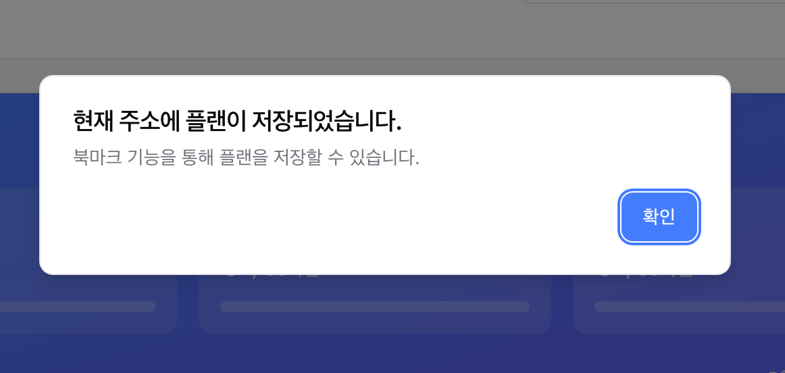
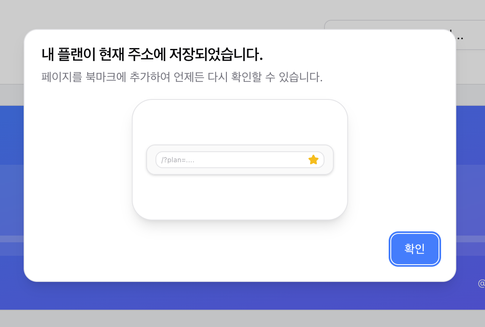

## 배경

[학점은행제 학점계산기](https://planner.chaesunbak.com) 서비스에는 비로그인 상태에서도 학점은행제 플랜을 쉽게 공유하고 저장할 수 있도록 URL로 저장하는 기능이 있다.

연결해둔 채널톡으로 해당 기능과 관련한 CS가 접수되었다.

```plaintext
Q : 저장했는데 북마크는 어디있나요?
```

_저장 버튼 클릭시 화면_



```
A : 현재 주소를 브라우저의 북마크에 추가하시면 플랜을 다시 확인하실 수 있습니다.
```

## 개선하기

의도한대로 답변을 해준 뒤에, 해당 기능을 개선할 필요를 느꼈다.

우선 UX 라이팅을 개선하기로 했다. 기존의 메세지 "저장되었습니다, 저장할 수 있습니다"는 현재 플랜이 저장이 된건지 아닌지, 추가적인 액션이 필요한지 아닌지 헷갈렸다. 또한, 북마크 기능이라는 것이 명확하지 않았다. 서비스 자체의 북마크 기능인이 브라우저의 북마크 기능인지 알 수 없다. 따라서 메세지를 개선해주었다.

또한, 백문이 불여일견이므로, 시작적인 피드백을 추가로 제공하기로 했다. 여기서 고민한 점은. 데스크탑, 모바일 마다 북마크 방법이 다르고, 사용자하는 브라우저마다 북마크 방법이 다르다는 것이었다. `navigator.userAgent` 속성을 확인해서 구체적인 브라우저 종류를 확인할 수 있지만 이는 너무 과하다고 생각했다. 적절히 타협하여 데스크탑, 모바일에서 각각 추상화된 북마크 애니메이션을 보여주기로 했다.

이때 webp나 avif같은 가벼운 포맷의 이미지로 애니메이션을 보여줄지, 리액트 컴포넌트를 만들어서 보여줄지 고민했다. 후자가 더 수정하기에 간편하다고 생각해서 후자를 선택해주었다.

_개선 후 이미지_



북마크 애니메이션은 [스토리북](https://storybook.planner.chaesunbak.com/?path=/docs/features-calculator-bookmarkanimation--docs)에서 확인할 수 있다. 데스크탑과 모바일에서 다른 컴포넌트를 보여주기 위해서는 `<Responsive/>` 유틸리티 컴포넌트를 만들고 사용해주었다.

## 가속화하기

내 서비스의 모든 문구를 점검할 필요를 느꼈다.

우선 메세지들을 한 곳에서 관리하기 쉽도록 컴포넌트에 하드코딩 되어있던 메세지들을 상수로 분리해줬다. `features/(feature)/constant/messages.ts`처럼 기능별로 묶어주었다. 모든 텍스트를 분리하기보다는 우선 토스트나, 다이얼로그로 사용자에게 피드백을 주는 경우를 분리해주었다.

다음 UX 라이팅 베스트 프랙티스들을 학습해서 ux-writer [SKILL](https://platform.claude.com/docs/ko/agents-and-tools/agent-skills/overview)을 만들어준다. 그 다음 해당 스킬을 추가해주면 'UX 라이팅 개선해줘'와 같은 작업을 내렸을때 에이전트가 해당 스킬이 필요하다고 판단하면 해당 스킬을 읽고 작업에 참고한다.

이를 통해 매우 간편하게 기존에 통일되지 않았던 어투를 통일하고 불친절한 표현을 찾아 개선할 수 있었다.
