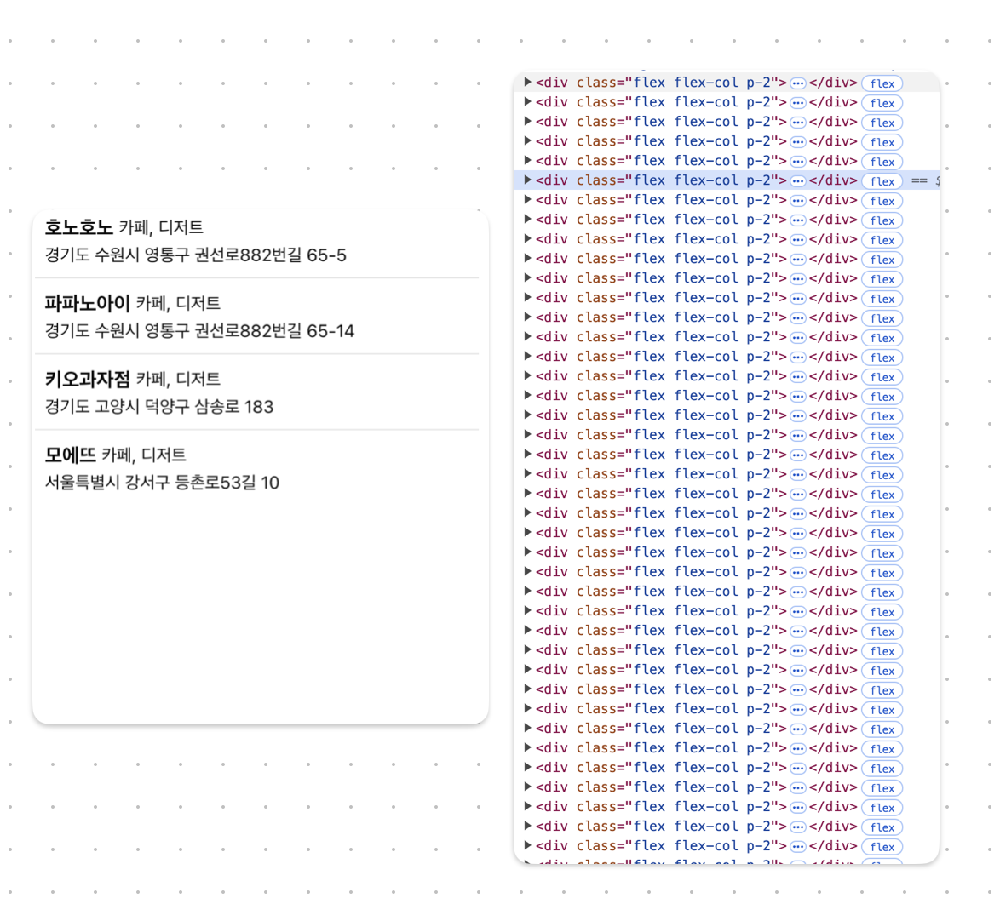

유튜브에 나온 인플루언서들의 맛집을 조회할수 있는 지도 웹앱 [먹튜브](https://matzip.chaesunbak.com/)를 개발하면서, [MVP 개발](https://ko.wikipedia.org/wiki/%EC%B5%9C%EC%86%8C_%EA%B8%B0%EB%8A%A5_%EC%A0%9C%ED%92%88)이 가장 큰 목표였다. 갑자기 떠올린 사이드 프로젝트 아이디어인 만큼 짧은 시간안에 중요한 기능만 개발하고 싶었다. **따라서, 빠른 개발을 위해서 데이터를 공통 편집하기 유용하며 별도의 백엔드 인프라가 필요하지 않은 구글 시트를 DB로 선택했다.** 일단 비효율적이라도 구현하고, 최적화는 필요한 경우에만 나중에 하기로 했다.

[관련 포스팅 : 구글 시트 CORS 에러 삽질기](https://chaesunbak.com/5)

## 문제상황

간단한 구현을 위해, 앱 접속시 디비의 모든 데이터를 패칭해 이를 리스트와 마커로 띄워주고 있었다. 그런데 데이터를 약 100개 정도 있는 상황에서 리스트에서 렌더링이 제대로 되지 않는 현상이 발생했다. 문제를 정확히 파악하기 위해 개발자도구에서 네트워크 탭과 요소 탭으로 확인해보아도, 네트워크 요청도 올바르게 이뤄지고 있었고, 요소에도 잘 포함되어있었다.



이러한 현상의 원인이 **DOM요소가 너무 많아서 발생하는 것이라고 판단하고 이를 줄일 필요를 느꼈다.**

## 선택지

DOM 요소를 줄일 수 있는 선택지는 다음과 같았다.

1.  API 개편 : 전체 데이터를 요청하는 것이 아니라 더 적은 요소만 요청하고 렌더링, 화면 변경시 재요청 로직 구현 필요. 백엔드와 프론트엔드 모두 작업 필요.
2.  윈도잉 도입 : 화면의 가시 영역의 요소만 렌더링방식. 프론트엔드에서만 작업 필요.

API 개편은 고민해야할 요소가 많고, 복잡도가 높았다. 두번째 방법은 한번 적용해놓으면 이후에도 유효하다는 장점이 있기 때문에 윈도잉을 도입하기로 결정했다.

## 윈도잉이란?

윈도잉(Windowing)이란 목록 가상화(List Virtualization)라고 불리기도 하며 화면에 가시영역에 해당하는 DOM 요소만 렌더링 하는 기술을 말한다. 대량의 목록 데이터를 효율적으로 렌더링하기 위해 주로 사용된다.

[참고 자료 1 : What is windowing?..](https://dev.to/praekiko/what-is-windowing-also-i-have-heard-about-react-window-and-react-virtualized-2ja7)

## 윈도잉 라이브러리 선택하기

윈도잉 라이브러리 후보는 기능과 사용 사례를 비교한 뒤 결정했다.

윈도잉 라이브러리는 `@tanstack/react-virtual`을 선택했다. 네 가지 라이브러리 모두 기본적인 기능은 지원하고 예시도 잘 나와 있어서, 기본적인 윈도잉을 도입하는데는 문제가 없어 보인다.

[참고자료 2 : npm trends](https://npmtrends.com/@tanstack/react-virtual-vs-react-virtualized-vs-react-virtuoso-vs-react-window)

## 윈도잉 적용하기

우선 DOM 요소를 줄이는 것이 목표였으므로, 이 효과를 극대화하기 위해 아이템 컴포넌트의 구조를 개선하여 DOM요소를 줄여준다.

```ts
//수정 전
function Item(data){
    return (
        ...
            <div className="flex gap-1 text-sm">
          <span>place.주소}</span>
          <span
              className="cursor-pointer text-blue-500"
          onClick={ ... }
        >
            복사
       </span>
     </div>
    )
}

//수정 후
function Item(data){
    return (
        ...
            <div className="inline text-sm">
          {place.주소}{" "}
          <span
              className="cursor-pointer text-blue-500"
          onClick={ ... }
        >
            복사
          </span>
     </div>
    )
}
```

그 다음 공식문서의 예시를 참고하여 윈도잉을 적용해준다. 처음에는 아이템들의 높이가 고정인 [Fixed Windowing](https://tanstack.com/virtual/latest/docs/framework/react/examples/fixed)을 적용하였으나 이후 개발하면서, 주소 등의 긴 경우 높이 차이가 발생하도록 변경될 수 있도록 [Dynamic Windowing](https://tanstack.com/virtual/latest/docs/framework/react/examples/dynamic)으로 수정했다.

```
export function PlaceList({
  data,
    ...
}: PlaceListProps) {
    ...

  // The scrollable element for your list
  const parentRef = useRef(null);

  // The virtualizer
  const virtualizer = useVirtualizer({
    count: sortedData.length,
    getScrollElement: () => parentRef.current,
    estimateSize: () => 84,
  });

  const items = virtualizer.getVirtualItems();

  if (error) {
    return (
      <div className="flex h-40 flex-col items-center justify-center gap-2 p-4 text-center">
        <p className="text-destructive font-semibold">오류가 발생했습니다</p>
        <p className="text-muted-foreground text-sm">{error.message}</p>
      </div>
    );
  }

  ...

  return (
    <div
      ref={parentRef}
      className="h-full w-full overflow-y-auto"
      style={{
        contain: "strict",
      }}
    >
      <div
        className="relative"
        style={{
          height: virtualizer.getTotalSize(),
        }}
      >
        <ul
          className="absolute top-0 left-0 w-full divide-y p-1"
          style={{
            transform: `translateY(${items[0]?.start ?? 0}px)`,
          }}
        >
          {items.map((virtualRow) => {
            const place = sortedData[virtualRow.index];
            return (
              <li
                key={virtualRow.key}
                data-index={virtualRow.index}
                ref={virtualizer.measureElement}
                className="flex w-full flex-col p-2"
              >
                  ...
              </li>
            );
          })}
        </ul>
      </div>
    </div>
  );
});
```

[참고자료 3 : TanStack Virtual Examples Dynamic](https://tanstack.com/virtual/latest/docs/framework/react/examples/dynamic)

## 회고

이번 사이드 프로젝트는 주말동안 갑자기 떠오른 아이디어를, 2~3일이라는 짧은 시간안에 구현하게 되었다. MVP를 만드는 것에 집중해서 정말 단순하게 만들었지만, 오히려 그 속에서 짧은 순간의 의사결정이 정말 소중했던 것 같다. 이번 프로젝트를 통해서 일단 구현하고 최적화는 나중에라는 교훈을 실천할 수 있었고, 이를 앞으로의 개발에서도 적용하면 좋을 것 같다.
